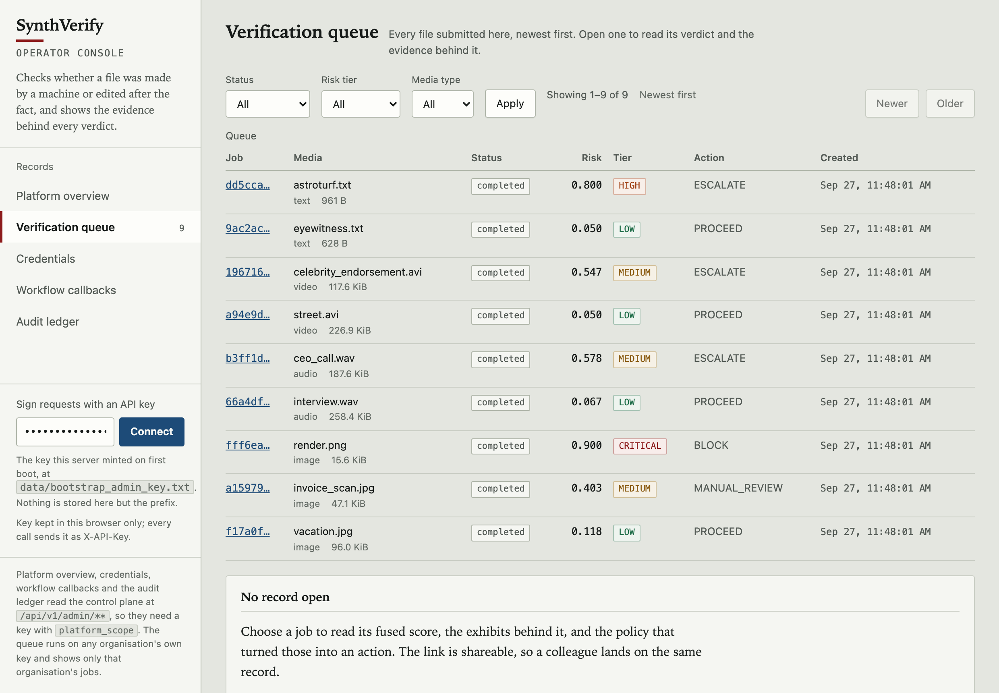

# ◈ SynthVerify — Enterprise Synthetic Media Verification Pipeline

> **Status: v1.0.0 — the platform is fully built and publishable: 1023 tests, 0 failures, 0 errors on the SQLite leg (21 dialect/service skips, each with its reason), lint- and type-clean**
> and the second time on the tree that ships (macOS/arm64 on SQLite and on a real `postgres:16` server, and
> linux/aarch64 containers on Python 3.12 and 3.13 — the suite is not skipped on any of them), lint-clean, plus
> six end-to-end gates that each execute a claim rather than describe one:
>
> - **Scale** — a two-replica Postgres-backed deployment, 15 database-side assertions + 2 mutation runs (`make scale`)
> - **Rate limit** — one shared budget across separate processes through a real outage, 21 assertions + 3 mutation runs (`make ratelimit`)
> - **Trace** — one request's id followed across two OS processes into its metrics exemplar, audit rows and worker log line, 29 assertions + 4 mutation runs (`make trace`)
> - **Retention** — per-org TTL, legal-hold pin, idempotent replay, graded by what it *refuses* to delete (including a bucket that says no): 42-case baseline + 13 mutation runs (`make retention`, `make retention-mutations`)
> - **Ledger** — `AC-IDAM-4` measured rather than promised: a million chained events verified single-threaded on both dialects by the same script that fails a build whose streaming read is disabled; 11 mutation runs (`make ledger`, `make ledger-postgres`, `make ledger-mutations`)
> - **Freedom** — FC-1 licence scan, FC-3 model manifests, FC-4 offline proof at the syscall *and* sealed-container levels, the 53-pin `requirements-lock.txt` checked against `pyproject.toml` and against two cold container builds, and the Alembic migrations. No paid broker and no metered service anywhere in the path.
>
> `main` is now the thesis measurement line and has moved past that tag: **1023 tests, 0 failures, 0 errors**
> (21 visible skips, all on the SQLite-default leg where the Postgres- and Valkey-only cases print their reason),
> re-measured on this tree — the SQLite figure above is current; the container legs below were last certified at
> the tagged `1.0.0` size and are marked **RE-MEASURE PENDING** where they have not been re-run since. The six
> legs above were certified at 753 tests on the tagged tree, and §2.5 says which row counts which.
>
> See [Verification status](#25-verification-status) for every command, its exact output and what each number
> does *not* prove. What is **not** proven: that any detector catches real synthetic media. All 11 are
> hand-written heuristics, and this repo's own fixtures only show a rule responding to its own trigger. The
> machinery that turns that into evidence is here — `synthverify/eval/` (AUC with DeLong intervals,
> interpolated EER, equal-mass ECE, average precision), a resumable score table, a corpus loader with a
> committed hash split, and `synthverify score` / `synthverify eval` gated in CI on a fixture corpus.
> `eval` reads **one named split** — `held_out_test` unless told
> otherwise — cross-checks every row it keeps against the committed assignment, and refuses a selection
> that has too few rows, no rows, or only one class under it; sixteen CI mutations prove each of those
> refusals can fail. The first real tranche has now been measured, outside CI and on an operator's own
> download: 2,376 images from `CommunityForensics-Eval`'s `CompEval` split
> ([`docs/corpus-communityforensics.md`](docs/corpus-communityforensics.md)) put the best pooled held-out AUC
> at **0.8585**, leave three of the four detectors that report **below chance**, and — in a null control with
> one class on both sides — put the same detector at **0.6998** separating two pools of *real* photographs.
> So the honest headline is that the shipped heuristics are not sufficient, not that they work. Still
> unmeasured: any learned detector, and a corpus whose container and size do not track class.
> See [§2.1a What is not proven](#21a-what-is-not-proven). Ready for feature work — see [Roadmap](#-roadmap--whats-left-to-do).

An enterprise API orchestration framework that **ingests digital media (image / audio / video / text), runs multi-detector forensic models, and outputs human-readable Explainable AI (XAI) risk flags directly into enterprise workflows** — routing decisions like `PROCEED`, `MANUAL_REVIEW`, `ESCALATE`, `BLOCK`, backed by named evidence and a tamper-evident audit trail.

## The console, as it runs

Four screens from this repository running as shipped: the same `synthverify.app:create_app` factory
`make run` boots, against an empty SQLite database, with nine media files generated by
`tests/fixtures_gen.py` POSTed to `/api/v1/media/ingest` and the audit chain sealed at
`SV_AUDIT_CHECKPOINT_EVERY=10`. Not a mock-up and no hand-written rows — every number below is what
the pipeline returned for those nine files, and the average pipeline time is their measured duration.

| | |
|---|---|
| **Platform overview** — throughput, the risk-tier spread across scored jobs, which workflow action recent completions routed to, and whether anything is actually listening for callbacks. | **Verification queue** — one organisation's queue, filterable by status / tier / media type. `Action` is the routing decision the policy reached; opening a row loads the report below. |
|  |  |
| **Job report** — the fused risk in the seal, the plain-language narrative, machine-readable flags, each detector's own score and findings as a numbered exhibit, and the error-level-analysis image the detector wrote. Exhibit bars are per-detector scores, not votes. | **Audit ledger** — the hash chain re-hashed row by row on load and cross-checked against every sealed range, newest first, with each entry's own chain hash. This is the endpoint that used to occupy the event loop; it now runs on a worker thread, so the console stays live while it works. |
|  |  |

---

## 1. Goal — why this project exists

**Real-world problem.** The surge in AI deepfakes is driving:
- **financial fraud** — voice-cloned "CEO" / "family in trouble" calls, synthetic-identity KYC selfies;
- **identity theft targeting vulnerable populations** — the elderly are the primary target of clone-call scams and coercion "proof-of-life" media;
- **widespread misinformation** — fabricated photos/videos of public figures erode democratic discourse.

**Systems & BA solution.** Not "one model" but an **orchestration layer**: one choke-point API that any enterprise channel (support line, KYC flow, newsroom CMS) can send media to, which runs *multiple independent detectors*, fuses them into a *decision a business can route on*, and integrates into existing workflows (case management, fraud queues, SIEM) via signed webhooks.

**Societal impact — SDG 16 (Peace, Justice & Strong Institutions).** Protects democratic integrity (newsroom verification), prevents financial exploitation of citizens (voice-clone payment interception), and restores digital trust in public media. The **hash-chained audit log** is the "strong institutions" centerpiece: every automated decision is explainable *and* tamper-evidently recorded. Full business analysis (stakeholders, requirements traceability, KPIs, SDG-16 target mapping) → [`docs/ba-context.md`](docs/ba-context.md).

**Deliberate design stance.** Built-in detectors are classical signal-processing heuristics — fast, deterministic, dependency-light, and *explainable by construction*. They are strong flags, not proof; the engine itself refuses to conclude when coverage/confidence are too low (`NEEDS_HUMAN_REVIEW`). The plugin interface exists so trained ML models can be dropped in later without touching anything else.

---

## 2. What has been built (current state)

Everything below is **implemented and tested** — unit + integration + e2e, including a live uvicorn
server (the counts and the command that produces them are in [§2.5](#25-verification-status), and
they are re-measured at every tranche rather than copied forward), `ruff` clean, fresh-boot smoke
test verified with curl.

"Tested" here means the *machinery* is verified: routing, fusion arithmetic, tenancy, rate limits, offline
behaviour, ledger integrity, latency. It does **not** mean the detectors are verified against real synthetic
media — they are not, and [§2.1a](#21a-what-is-not-proven) states exactly what is unmeasured. Keep the two
claims apart; conflating them is the easiest way to overstate this project.

### 2.1 Forensic detector engine — 11 detectors, plugin registry

> **Read this column for what it is.** Every detector below is a hand-written signal-processing rule, and every
> number is produced on samples that **this repository generates itself** in `tests/fixtures_gen.py`. Those
> samples are built to contain the exact signature the rule looks for, so the numbers show the rule *responds to
> its own trigger* — they are ordering assertions that catch a regression in CI. They are **not** accuracy, AUC,
> or any evidence about real-world deepfakes. Real labelled images have now been measured, outside CI and on an
> operator's own download, and the honest summary of what came back is in
> [§2.1a What is not proven](#21a-what-is-not-proven) and in full in
> [`docs/corpus-communityforensics.md`](docs/corpus-communityforensics.md).

| Detector | Media | Signal used | Behaviour on this repo's own fixtures |
|---|---|---|---|
| `ela` | image | re-compression error-field uniformity (16×16 grid), hotspot localization, PNG heatmap artifact | natural 0.18 vs doctored 0.60 |
| `metadata` | image | EXIF camera/software/timestamps, PNG text chunks, AI-tool signature list, C2PA/JUMBF markers | Photoshop tag 0.50, AI tag 0.95 |
| `frequency` | image | radial spectral profile (p98/ring), JPEG-harmonic exclusion, checkerboard lattice energy | AI render 0.42 (flag) vs natural 0.01 |
| `noise` | image | per-block MAD noise floor, cross-block inconsistency, 2px-lag residual autocorrelation (lossless only) | AI render 0.95 (structured residual) |
| `jpeg_history` | image | DQT parsing + IJG quality inversion, double-compression evidence | q95 vs re-saved chains |
| `audio_spectral` | audio | STFT flatness stability, spectral-flux discontinuities, high-band occupancy | voice-clone flags (band-limited, jumps) |
| `audio_dynamics` | audio | silence-run structure, digital-zero share, dynamic range, clipping | DIGITAL_SILENCE + UNIFORM_PAUSES on clones |
| `audio_metadata` | audio | RIFF INFO walk, TTS encoder signatures, sample-rate tells | `Lavf` tag, 16 kHz canonical format |
| `video_temporal` | video | photometric flicker (2nd derivative), adaptive duplicate-frame hashing, cut structure | deepfake 0.67 (flicker + dup pairs) |
| `video_metadata` | video | generator-native geometry (256² squares), fps sanity, per-frame ELA CV | GENERATOR_GEOMETRY flag |
| `text_stylometry` | text | burstiness (sentence-length CV), LLM stock phrases, connective density, TTR, n-gram repetition | AI text 0.80 vs human 0.05 |

#### 2.1a What is not proven

None of the detectors reference a trained model (`ml_model` is unset on all 11), and nothing in the
**shipped test path** touches a third-party corpus — CI grades the chain on twelve generated PNGs and
refuses to call that a result. What changed is that a real labelled corpus has now been measured
*outside* CI, on an operator's own download, and the answer is in
[`docs/corpus-communityforensics.md`](docs/corpus-communityforensics.md): 2,376 images from
`OwensLab/CommunityForensics-Eval`'s `CompEval` split, eight generators, held-out AUCs with DeLong
intervals. Concretely, the state of each unmeasured claim:

- **measured now** — behaviour on images from real generators. Pooled held-out AUC: `noise` **0.8585**
  [0.7920, 0.9063], `frequency` 0.4352, `ela` 0.3551, `metadata` 0.0377, `jpeg_history` refused for
  carrying one class. Three of the four that report land **below chance**.
- **measured, and it refutes the headline** — the same five detectors run against *null controls* (one
  class on both sides) put `noise` at **0.6998** separating two pools of *real* photographs from each
  other, and `frequency` at 0.7454 separating two generators that share pixel size, container and
  source pool. A detector that moves that much on differences that are not generation is not measuring
  generation, so 0.8585 is reported as confounded rather than as performance.
- **still unmeasured** — generalisation to a generator outside those eight, calibration of the fused 0–1
  score (`pytest -m calibration` is specified and still absent), and error rates across any demographic
  or source group (`REQ-DET-3` per-group parity has no data to grade).
- **now knowable, and it is the binding constraint** — the corpus confounds container and size with
  class: all 1,653 fakes are PNG at four sizes while 691 of the 723 reals are JPEG across 401 sizes, so
  the rule "it is a JPEG, therefore real" is right 98.65 % of the time. **Every fake-versus-real AUC
  here is an upper bound on detection ability, not an estimate of it**, and closing that needs a new
  fetch of size- and container-matched reals rather than a new analysis of these bytes.

The `synthverify/model-manifest/v1` schema already demands measured AUC, EER, ECE and per-group metrics from a
permissively licensed held-out set, and CI fails a manifest that breaches its committed gates. That gate is
still vacuous: it checks a claimed number is *plausible*, never that it was *measured*. What changed since this
section was written is the left half of that sentence — the measuring. `synthverify/eval/` holds the metrics
(Mann-Whitney AUC with ties at half credit, DeLong's interval on the logit scale, interpolated EER, equal-mass
ECE, average precision), a line-delimited score table a killed run resumes, a corpus loader that reads a
declared layout and downloads nothing, a split assigned by hash and re-derived on load, and the `synthverify
score` / `synthverify eval` CLI that ties a run to the SHA-256 of the split file it used. `eval` reads
**one named split** — `held_out_test` unless an operator names another — reports the rows it set aside,
refuses a selection that is empty or single-class, and cross-checks every row it keeps against the
committed assignment, so a headline metric can no longer be computed over rows that include `train` while
being labelled held-out. Its own CI leg grades
the chain over twelve generated PNGs and asserts the *refusals*, because a twelve-sample cell is below the
`MIN_CELL_N=30` gate and no fixture is allowed to look like a result.

So the run has happened and the remaining gap is the other two: `pytest -m calibration` comparing what
that corpus measures against the committed gates (specified, and still absent), and at least one learned
detector for `REQ-DET-1..3` — which is the thesis claim, and it is not tested by anything above. Within
CI, every number `synthverify eval` prints still describes a fixture; outside it, the numbers in
`docs/corpus-communityforensics.md` describe real bytes and say the shipped heuristics are not
sufficient, which is the reason the claim is a learned detector rather than these five.

Fused end-to-end verdicts on the fixture corpus (all in `tests/fixtures_gen.py`, deterministic — same caveat
applies: this is a self-consistency check, not detection performance):

| Sample | Risk | Tier | Action |
|---|---|---|---|
| camera photo (EXIF, sensor grain) | 0.118 | LOW | PROCEED |
| spliced + Photoshop-tagged photo | 0.403 | MEDIUM | MANUAL_REVIEW |
| AI-generated render (smooth + checkerboard + SD params) | 0.900 | CRITICAL | BLOCK |
| human speech recording | 0.067 | LOW | PROCEED |
| voice-clone / TTS | 0.578 | MEDIUM | ESCALATE (6 flags) |
| handheld video | 0.050 | LOW | PROCEED |
| deepfake-style video (256², flicker, loop splice) | 0.547 | MEDIUM | ESCALATE |
| human-written post | 0.050 | LOW | PROCEED |
| LLM-written astroturf | 0.800 | HIGH | ESCALATE |

### 2.2 XAI fusion engine (`synthverify/xai.py`)

- Confidence-weighted fusion: `fused = Σ(wᵢ·sᵢ·cᵢ) / Σ(wᵢ·cᵢ)`
- Strong-evidence override: `fused = max(fused, maxᵢ(sᵢ·cᵢ)·0.9)` — one near-certain alarm isn't diluted to silence
- Declared-synthetic rule: any detector with conf ≥ 0.85 **and** score ≥ 0.85 forces ≥ 0.90 → BLOCK
- Honest inconclusiveness: low coverage/confidence → `NEEDS_HUMAN_REVIEW`, never a fake verdict
- Plain-language narrative paragraphs, ranked top-evidence lines with contribution values, 38-entry flag glossary
- Policy routing with `review ≤ escalate ≤ block` enforced; **per-org at run time** — each analysis resolves the submitting org's active `PolicyProfile` → stored `global` profile → settings defaults, and the report records the resolving profile in `policy_name`

### 2.3 Enterprise orchestration

- **Async jobs**: `POST /media/ingest` → durable DB job → embedded thread-pool `WorkerFleet` (priority queue, crash recovery re-enqueues orphans) → inline-processing fallback when no fleet
- **Queue broker seam** (`synthverify/brokers/`, `SV_JOB_BROKER=embedded|postgres`): `embedded` is the
  in-process priority queue and stays the default; `postgres` claims work with
  `UPDATE … WHERE id = (SELECT … WHERE status='queued' ORDER BY priority, created_at LIMIT 1 FOR UPDATE
  SKIP LOCKED) RETURNING id`, so any number of replicas and worker containers share one table with no
  Redis, no RabbitMQ and no paid broker. A claim writes `claim_token`/`claimed_by`/`lease_expires_at` and
  bumps `attempts` in the *same* statement; the terminal write is fenced on `claim_token` *inside* the
  UPDATE, so a worker whose lease expired cannot overwrite the replacement's result — it loses, counts
  `synthverify_jobs_fenced_total` and rolls back. Expired leases are reclaimable, so a crashed replica
  cannot wedge the queue. `process_job(db, job_id)` is the unit of work in both backends.
- **Scale-out topology that is tested, not described**: `docker/compose-scale.yml` + `make scale`
  run two worker-less API replicas and a separate two-container worker tier against one Postgres, and
  `scripts/scale_e2e.py` asserts exactly-once **from the database** (see §2.5)
- **A rate limit that is one limit, not one per replica**: `SV_RATE_LIMIT_BACKEND=valkey` moves the
  token bucket into a **Valkey** server (BSD-3 — deliberately not Redis ≥ 7.4, whose RSALv2/SSPL
  tri-licence FC-1 forbids) and the drain runs as one atomic Lua script, so `n` replicas share one
  budget instead of multiplying it. `check(subject) -> (allowed, retry_after)` did not change
  signature, semantics or caller — §6 item 21
- **Sync analysis**: `POST /media/analyze` (≤ 8 MiB) returns the full report inline
- **Batch ingest** (≤ 20 files, itemized failures), **idempotency keys** (safe retries)
- **Webhooks**: per-org endpoints, event filtering (`job.completed` / `job.failed` / `*`), HMAC-signed payloads (`t=<unix>, v1=hmac_sha256(secret, "<t>.<body>")`), exponential-backoff retries with a full delivery ledger, test-ping endpoint
- **Auth**: `sv_live_…` API keys (only SHA-256 hashes stored). Privilege has two independent axes: **role**
  (admin/analyst/service) decides *which endpoints* a key may call, and **`organisation`** decides *whose
  data* it may touch — so `admin` is not a cross-tenant superuser. Cross-tenant reads are denied as `404`,
  never `403` (a `403` leaks that the resource exists). Reaching every organisation is an explicit property
  of the credential — the `platform_scope` column, accepted only alongside `role: admin` — not a magic org
  name and not a role; the bootstrap admin key is the one row `0005` promotes. The control plane
  (`/api/v1/admin/**`) requires role **and** platform scope; there is no per-organisation admin in v1
- **Rate limiting**: per-key token bucket with `429` + `Retry-After`, in-process (default) or shared through Valkey; an unreachable shared backend **fails closed to the in-process bucket** rather than erroring or hanging, so the offline guarantee (FC-4) survives the swap
- **Audit ledger**: every security-relevant event hash-chained (`SHA256(canonical(entry + prev_hash))`); `GET /admin/audit/verify` and `synthverify audit-verify` recompute the whole chain and pinpoint tampering by `seq`. Appends are made safe against concurrent writers — the read-head → insert pair is serialised by a PostgreSQL transaction-scoped advisory lock and by `BEGIN IMMEDIATE` on SQLite — so a chain cannot *fork* when more than one thread, process or replica is writing (`docs/architecture.md` §Concurrency; found by the AC-INFRA-2 run, see §6 item 20)
- **Ledger checkpoints** (`REQ-IDAM-4`, `audit_checkpoints`, migration `0007`): every `SV_AUDIT_CHECKPOINT_EVERY` appends (5 000 by default) the chain is *sealed* inside the same transaction — one row naming the range it closes (`prev_seq + 1..seq`), the head hash that range reaches, **how many events it holds**, and the previous seal's hash, so the seals chain over themselves. Verification still hashes every row: a checkpoint is a fixed point to compare against, never a licence to skip work, and the report carries `entries_checked` beside `checkpoints_checked` so "did you skip?" is answerable from the response rather than from the source. What the seals add is *location* and a second, independent witness — a forger who re-links the chain after editing is contradicted by the seal, and one who re-points the seal too is contradicted by its recorded range size. `synthverify audit-checkpoint --backfill` seals an install's existing history, **verifying it first** and refusing to seal a chain that does not check out, because sealing broken history would promote a forgery into a fixed point. `AuditLedger.verify` reads the
chain through a server-side cursor, in pages of 1 000 column-rows, so the walk over a million events
holds a page rather than a copy of the ledger — `scripts/ledger_bench.py` prints both shapes on every run
- **One trace id, four places** (`REQ-INFRA-6`, `synthverify/tracing.py`): a request arrives with a W3C
  `traceparent`, and the *same* id is then visible in that request's `/metrics` exemplars, in its job's
  row, in every `audit_events` row that request writes, and in the log line its worker emits. The header
  is validated against the grammar before it is reused — 32 lowercase hex, non-zero, ≤ 560 bytes,
  reserved version rejected — and a header that fails is replaced by a minted id rather than echoed, so
  a caller cannot steer a label, a column or a log line (§6 item 23). `jobs.trace_id` is what carries the
  id across the thread/process boundary (contextvars do not cross those), and `audit_events.trace_id` is
  committed to by the entry hash *only when set*, so chains written before migration `0004` still verify
- **Per-org retention with legal-hold pinning** (`REQ-INFRA-5`, `synthverify/retention.py`): a TTL is a
  **row**, not a config file — `PUT /admin/retention/policies/{org}` sets `media_ttl_days`, no row means
  "keep forever", and `SV_RETENTION_DEFAULT_DAYS` is the only global. A pass **plans before it deletes**, and
  because storage is content-addressed that planning is a reference count, not a `DELETE`: a stored object or
  a digest-named heatmap file is removed only when no surviving row in *any* organisation still names it, so
  two tenants over one object survive each other's TTL. An active `legal_holds` row matching the asset's
  `sha256` or one of its job ids blocks the deletion — and the pin is itself written to the ledger when it is
  created, which is the half of `AC-INFRA-5` that makes a hold evidence rather than a flag; a queued or
  running job **defers** its asset instead of deleting under the worker. Rows plus the `retention.swept`
  ledger entry commit **first**, bytes go **after** the commit, because a sweep that rolled back after
  removing an object would leave rows pointing at missing evidence. The scheduler is a thread on
  `WorkerFleet` (`SV_RETENTION_SWEEP_ENABLED`, `SV_RETENTION_SWEEP_INTERVAL_SECONDS` default 3600, sleeping
  before its first pass so a restart cannot purge), the same code is reachable from
  `synthverify retention-sweep [--apply]` and `POST /admin/retention/sweep` — where `dry_run` defaults to
  **true**, so the dangerous shape is the one a caller has to change — and the pass is idempotent: nothing is
  deleted twice, the held set is identical across passes, and a pass that deleted nothing appends no ledger
  row
- **Observability**: Prometheus text metrics (`/metrics`, with OpenMetrics 1.0 exemplars on the counters
  that a trace id can name), `/healthz`, `/readyz`, per-request `X-Process-Time-Ms` + `X-Request-ID` +
  `X-Trace-Id` + an echoed spec-valid `traceparent`, correlated log format (`%(sv_trace_id)s`, installed
  by `serve` *and* by `worker`), and the alert rules themselves as a file in the repo
  (`docker/prometheus-alerts.yml`, 14 rules in 3 groups) that `synthverify alert-rules` parses and
  cross-checks against the metrics this process actually exposes — no collector, no vendor, no metered
  APM in that path (FC-5)

### 2.4 Interfaces & deployment

- **REST API** — OpenAPI 3.1 at `/docs`; full reference in [`docs/api.md`](docs/api.md)
- **Python SDK** — `synthverify.client.SynthVerifyClient` (`analyze_file`, `verify_and_wait`, `create_key`, `verify_audit_chain`, …)
- **CLI** — `serve`, `worker` (consume the shared queue, no HTTP listener), `analyze [--json] [--heatmap] [--dir DIR --jsonl OUT]`, `score [--scan-dir DIR --dataset N --generator N --real-dir D --manifest F --split-file F --table F] [--sample/--limit/--require-all/--force/--dry-run]`, `eval [--table F --split-file F --split held_out_test] [--by-generator/--detectors/--allow-thin/--dry-run/--json]`, `create-key`, `audit-verify`, `audit-checkpoint [--backfill] [--every N]`, `list-detectors`, `db-upgrade [--url] [--stamp] [--print-sql]`, `licenses`, `model-manifests`, `freedom`, `dependency-lock [--write]`, `alert-rules [--rules] [--json]`, `retention-sweep [--apply] [--organisation] [--limit] [--json]`
- **Operator dashboard** — single-file HTML/JS at `/dashboard`: stats cards, job queue with risk tiers, status/tier/media filters, full report viewer (score, flags with explanations, narrative, per-detector bars, applied policy name), **inline forensic artifact rendering** (auth-fetches ELA heatmaps into the job detail), API-key and webhook management, live audit-chain verification
- **Content-addressed storage** (`<sha256[:2]>/<sha256>_<name>`), content-sniffing by magic bytes (extension never trusted), decompression-bomb guard
- **Docker** (non-root user, healthcheck, volume) + docker-compose + GitHub Actions CI (lint → the whole suite twice as a `sqlite`/`postgres` matrix → freedom gates → product-on-Postgres e2e + bare-install deploy path → **AC-INFRA-2 two-replica scale stack, plus both mutations of it** → **AC-INFRA-3 shared limiter across processes, plus its three mutations** → **AC-INFRA-6 one trace id across two processes, plus its four mutations** → **AC-IDAM-4 the 1 M-event ledger bench on both dialects, plus the checkpoint suite's eleven mutations** → container build → smoke test → air-gapped analysis). Two Postgres shapes ship: `docker/Dockerfile` stays driver-free (that is FC-1's licence position — nothing LGPL is *declared*), and `docker/Dockerfile.postgres` is a thin overlay that adds the pinned psycopg from `docker/requirements-postgres.txt` for operators who run the durable queue.
- **Config**: every knob via `SV_*` env vars (`synthverify/config.py`), `.env.example` included
- **Media I/O robustness**: WAV decoder + ffmpeg fallback, pure-Python MJPEG-AVI reader/writer, cv2→builtin→ffmpeg video decode chain, UTF-8/BOM-UTF-16/Latin-1 text with binary rejection

### 2.5 Verification status

Every row is a command that was actually run, from the repository root. `./.venv/bin/python -m …` is the
form because the console scripts in this venv carry stale shebangs from a migrated install. Counts come
from `--junitxml`, not from the tail of a terminal: at full-suite size `pytest -q -rs` ends on its skip
summary and the stats line is not the last thing printed, so "read the last line" silently mis-reports
which number is the pass count and which is the collected total.

**Which tree each row counts.** The container rows and the Postgres/Valkey leg are the **`v1.0.0`
release pass** (753 tests, measured 2026-09-27 on the tree that was tagged) and are quoted as that
measurement rather than as this tree's; where they have not been re-run on the current suite they are
marked **RE-MEASURE PENDING**. `main` has moved since: the SQLite full-suite row below reads
**1023 tests, 0 failures, 0 errors** (21 visible skips), re-measured on this tree — the +270 over the
tagged 753 is the thesis measurement harness (T53-T60) and the two IDAM tranches (T48 scopes, T49
JWT/OIDC). The measurement-harness rows, the T48/T49 rows and the lint row below *are* this tree's,
re-executed after the last code change to it. The Postgres/Valkey full-suite leg and the container
portability pair are **not** re-run on the 1023 tree in this pass (the two services are down on this box),
so those two rows carry their pre-T48 `753`-size result labelled as the previous measurement rather than a
borrowed current one; `scripts/postgres_e2e.py` likewise stands at its last-measured **16 checks passed,
0 failed, RESULT: PASS** pending a re-run with `postgres:16` up.

The four full-suite rows below are a **confirmation pass**: each was run again after a first pass at the same
size, an hour earlier, and every count came back identical while all four wall times moved. Where a number from
the earlier pass is quoted, it is labelled as the earlier pass. Editing these documents to carry those figures
is itself a change to shipped files, so the tests that read them were re-executed afterwards: the **21**
documentation guards in `tests/test_release_hygiene.py`, together with the three queue-summary cases, passed
**24 of 24** (1.1 s), and two further full SQLite passes ran on the edited tree (753 collected, 0 failures, 21
skips each; 165.6 s and 164.8 s). Two claims, kept distinct deliberately: the *code* those four legs certified
is the code that ships (`find` for anything modified after they began returns four `.md` files and nothing
else), and the *prose* is certified by the guards, which are cheap enough to run against the exact bytes being
published — and were, as the last action before the tree was frozen. A whole suite is not re-run to bless a
paragraph, and pretending otherwise would be the same category error this table exists to avoid.

| Check | Command | Result |
|---|---|---|
| Full suite (defaults: SQLite, no server needed) | `./.venv/bin/python -m pytest tests/` | **1023 tests: 1002 passed, 21 skipped, 0 failed, 0 errors** in 163.8 s (junit `tests=1023 failures=0 errors=0 skipped=21`) — the skips are the Postgres half of AC-INFRA-1 (5), the PostgreSQL-only lock/lease cases (8) and the advisory-lock-and-cross-connection-wait cases (3), all gated on `SV_TEST_POSTGRES_URL`, plus the five shared-bucket cases gated on `SV_TEST_VALKEY`; each printed with its reason rather than hidden. The suite grew from 753 to 1023 across T53-T60 (the eval/measurement harness: metrics, score-table, split, datasets, runner, CLI, calibration, collision-guard) and T48-T49 (the IDAM scopes and the JWT/OIDC bearer path) — see the per-suite rows below for each tranche's own count |
| T48 IDAM scope matrix | `… -m pytest tests/test_scopes.py` | **15 collected, 15 passed, 0 skipped** (4.4 s) — the scoped-key admission matrix (a `jobs:read` + `media:submit` credential reaches ingest and job-read, is refused elsewhere naming the missing scope), the legacy-key role-equivalent fallback, and the AC-IDAM-2/3 cross-org case |
| T49 JWT / OIDC bearer path (REQ-IDAM-1) | `… -m pytest tests/test_oidc.py` | **23 collected, 23 passed, 0 skipped** (3.1 s) — AC-IDAM-1's two halves (a locally minted RSA key's JWKS admits its own token; a token for another audience is refused), plus wrong-issuer, expiry, unknown-`kid`, missing-`kid`, the **algorithm-confusion** attack (a token hand-forged `HS256` with the *public* key as its HMAC secret — refused at the `SV_OIDC_ALLOWED_ALGORITHMS` allow-list before PyJWT ever sees the token), a signature from a foreign key, the OIDC-disabled short-circuit (FC-4: the JWT path opens no socket while `oidc_enabled` is false), the role-claim→role mapping table, the scope-claim→`require_scope` interop with T48, and `platform_scope` claim opt-in. RSA keys are minted in-test with `cryptography`; the JWKS fetch is monkeypatched, so the leg runs with zero network |
| Full suite against Postgres 16 + Valkey 8 | `SV_TEST_POSTGRES_URL="postgresql+pg8000://sv:sv@127.0.0.1:5432/sv_test" SV_TEST_VALKEY=127.0.0.1:6379 … pytest tests/` | **RE-MEASURE PENDING on the 1023-test tree.** The last full Postgres+Valkey leg was taken at the pre-T48 753-test size on the pinned package set (T39); T53-T60 and T48-T49 grew the suite by 270 cases, all of which pass on the SQLite leg above. The two services are not running on this box right now, so the number quoted here is the *previous* one, labelled as such rather than restated as current: `**753 tests collected, 753 passed, 0 skipped**, exit 0 in 235.9 s` against `postgres:16` (server 16.15) and `valkey/valkey:8`, with every fixture database dropped (`select count(*) from pg_database where datname like 'svtest%'` → **0**), corroborated on that same pass by a **20 ms** `pg_database` sampler (`samples=9858 | distinct=253 | peak_alive_at_once=1 | histogram={0: 1092, 1: 8766} | surviving_after_run=0 | sampler_errors=0`). The sampler's own history — a first attempt that printed `distinct=0 | sampler_errors=11067` beside a plausible histogram because its poll closure raised while still recording the count, and the run that did catch a two-database overlap the coarse interval missed — is kept below because it is why the instrument is trusted now, not because it is this pass's result. **The two fixtures that hold a second database are known from the source** (`tests/conftest.py:115`'s `child` alongside `app_env`, and `tests/test_brokers.py:142`'s `one`/`two` pair), not from the sampler, which can only corroborate them; an observed peak is a *lower* bound whose tightness is the sampling interval. No product defect appeared on the last leg: the two the Postgres path *could* surface (`str(URL)` password masking, FK enforcement) were fixed by T25. See §6 item 18 for why an identical pass count is not the evidence — the live-server witness is. **Before this row can carry a shipping number, re-run it on the 1023 tree with both services up** |
| …and on the interpreters the metadata advertises, on a second architecture | `docker run --network host … sv-port-{3.12,3.13} /venv/bin/python -m pytest tests` | **RE-MEASURE PENDING on the 1023-test tree.** The last portability pair was taken at 753 tests: **0 failures, 0 errors, 0 skipped on each**, 218.8 s on CPython **3.12** and 215.6 s on **3.13**, both `linux/aarch64`, against the same `postgres:16` + `valkey/valkey:8` over loopback, with the live `tests/`, `synthverify/`, `pyproject.toml`, `Makefile`, README and `ci.yml` mirrored into the container rather than the baked copy; `pg8000` installed inside the leg exactly as CI's `test` job does. Those two runs *found* the three portability bugs recorded in the CHANGELOG (a lock assertion only true on Apple Silicon, a marker test that inverted on 3.13, an in-test S3 mock that logged after flushing the reply), which is why the row exists. **What was never claimed:** macOS and Windows run this suite only on GitHub's runners, which have not executed this repository. The container legs need re-running against the 1023-test tree before the seconds and the interpreter counts are quoted as current |
| **Retention suite (`REQ-INFRA-5`)** | `… -m pytest tests/test_retention.py --junitxml=…` | **42 collected, 42 passed, 0 skipped** on SQLite (49.2 s) and **42 of the 112** in `tests/test_retention.py tests/test_tenancy_matrix.py tests/test_migrations.py` on `postgres:16` + Valkey (**112 collected, 112 passed, 0 skipped**, 91.5 s, `0` `svtest_*` surviving) — the split: 5 policy-is-opt-in, 5 sweep, 9 legal hold, 4 idempotence, 4 scheduler, 7 API surface, 1 metrics, 1 CLI, 4 in `TestTheTestsCanFail`, and 2 in `TestTheStoreRefuses` (a store that refuses the delete after the commit). `TestTheTestsCanFail` asserts the *negative* cases the other classes lean on (the seeding fixture really does put rows past their TTL, a sweep with no policy row is a genuine no-op, a plan that names nothing writes no ledger event, and a hold on a different digest blocks nothing) |
| …and the thirteen ways `AC-INFRA-5` can be faked | `make retention` → `… python scripts/retention_e2e.py [--mutate MODE]` | `--check-anchors` **PASS (all 13 mutation anchors quote exactly one place in the source)**; baseline **`[baseline] 42 cases, 0 failing → RESULT: PASS`**; **all thirteen caught** (`make retention-mutations`, exit 0, measured as failing cases out of 42): `no-hold` **8**, `job-pin-ignored` **1**, `shared-object` **1**, `shared-artifact` **1**, `dry-run-applies` **3**, `ttl-never-reads` **25**, `audit-no-detail` **1**, `inflight-undeferred` **1**, `scheduler-dies` **1**, `scheduler-uncounted` **1**, `scheduler-interval` **8**, `storage-swallows` **2**, `sweep-counted-late` **1** — each run prints the `caught by:` test ids, `--skip-baseline` makes the unmutated run certify the suite once instead of fourteen times, and a drifted anchor raises rather than no-opping. **One count is a range and the reason matters:** `scheduler-interval` (the loop ignores its one-second floor) failed **8** in the gate run and **12, 12** in two repeats, because a sweep spinning at 0.01 s deletes rows under whichever other cases happen to be running — the *verdict* is stable, and always includes `test_the_loop_waits_before_its_first_pass` and `test_a_failing_pass_does_not_kill_the_scheduler`, while the denominator of collateral failures is scheduling. A mutation that reaches shared state is measured by what it is *caught by*, not by how much it breaks. No `sv-retention-*` scratch survived (`find "${TMPDIR:-/tmp}" -maxdepth 1 -name 'sv-retention-*'` → no matches), which the CI job also asserts. **Two of `AC-INFRA-5`'s claims live outside this gate, on purpose:** that planning reads are serialised by an advisory lock (three cases in `tests/test_audit_concurrency.py`; deleting the call fails the ordering case and inverting the dialect guard fails the wait case, 1 of 7 each — see the queue/ledger row), and that the byte removal reaches an object store (four cases in `tests/test_media_store.py`, both backends — see the row above). Both are outside `tests/test_retention.py`, which is the suite this harness re-runs, so neither moved the denominator or needed the modes re-certified — **the third close-out addition did** (`TestTheStoreRefuses`, and the two modes built for it): 40 → 42 cases, eleven → thirteen modes, and the whole gate re-run to the counts above |
| **`AC-IDAM-4`: 1 M chained events verified, and tampering inside a sealed range detected** | `make ledger` → `… python scripts/ledger_bench.py --events 1000000 --every 5000`; `make ledger-postgres` adds `--postgres` | **`RESULT: PASS` on both dialects, exit 0**, every phase in its own process so its peak RSS is attributable. SQLite (floor 60.0 MiB): 1 000 000 events inserted in 69.8 s, sealed into **200** ranges in 14.9 s by the shipped backfill, verified in **11.38 s at 65.5 MiB (+5.5 over the floor)** where the read it replaces took **17.72 s at 2 391.9 MiB (+2 331.9)**. `postgres:16` 16.15 (floor 65.8 MiB): insert 499.4 s, seal 18.4 s, verified in **16.40 s at 69.3 MiB (+3.5)** against the materialising read's **23.18 s at 2 461.8 MiB (+2 396.0)**. The clause is **< 60 s single-threaded**; the margin is ≥ 3.6× on the slower of two runs (an earlier pair measured 7.40 s and 13.67 s — the seconds follow machine load, the megabytes did not move). `entries_checked == 1,000,000` on both legs, which is the checkpoint scheme proving it hashed every row rather than being trusted to. Then four probes on that same 1 M ledger: `mid-edit` → `entry hash mismatch at seq=500000: content was altered`; `relinked` → `checkpoint at seq=1000000 seals head b3c77366c068d64c… but the chain reaches 8e6bb706ea05db98…`; `deleted-resealed` → `seals 5000 events in range 995000 + 1..1000000; the walk found 4999`; and `relinked-resealed` → **`verified=True`**, which the run **requires**, because that is the documented privileged-rewrite boundary and the alternative to asserting it is prose that drifts better than the code. Each probe ends `the ledger came back clean` + `restore kept every row (1,000,000 of 1,000,000)`, and the run's private `svtest_ledger_*` database is dropped with `0` `svtest_*` surviving |
| **Checkpoint suite (`REQ-IDAM-4`)** | `… -m pytest tests/test_audit_checkpoints.py -q -rs --junitxml=…` | **36 collected, 36 passed, 0 skipped** on *both* dialects (junit `tests=36 failures=0 errors=0 skipped=0`; 5.3 s SQLite, 62.3 s `postgres:16`) — 5 **sealing** (a seal lands every N appends, records the range size it covers, names the chain's head at that seq, is opt-out and silences the table, and rolls back with the append it sealed), 7 **verify contract** (a clean chain counts both chains, `entries_checked` covers every row *including* sealed ranges, the page size does not change the verdict, `verify()` never mutates, an empty ledger, a pre-`0007` chain with no seals, and the cursor case), 9 **tampering inside a sealed range** (an edited detail, a forgery that repairs every later hash, a deleted row, a re-sealed forgery caught only by the recorded count, the prefix before the tamper still verifying, a seal whose own columns disagree with its digest, a replaced range, a deleted seal row, and a seal the chain no longer reaches), 4 **backfill** (seals an old ledger and still hashes everything, refuses to seal a chain that does not verify, cannot help history that was never sealed, and is a no-op with no interval), 10 in `TestTheDigestRule` (a pinned `BASE_DIGEST`, one case per covered column — 7 — the pointer being *in* the digest and not only in its column, `trace_id` counting only when present, and both read paths reporting the same break), and 1 `slow` case that verifies 100 000 events under the same 60 s clause (4.67 s). The cursor case is there because nothing else in the file can see it — the report is identical either way (measured: 67.3 MiB with, 302.3 MiB without, at 200 000 events, ~3 s both) |
| …and the eleven ways `AC-IDAM-4` can be faked | `make ledger-mutations` → `… python scripts/ledger_e2e.py [--mutate MODE]` | `--check-anchors` **PASS (all 11 mutation anchors quote exactly one place in the source)**; baseline **`[baseline] 35 cases, 0 failing → RESULT: PASS`** (the `slow` 100 000-row case is deselected — the 1 M criterion is measured once, by the bench above, not eleven times); **all eleven caught** (exit 0, measured as failing cases out of 35): `no-seal-on-append` **12**, `wrong-seal-head` **13** (an off-by-one seal makes a *clean* ledger report tampering, which is how an operator learns to switch verification off), `seal-head-unchecked` **2**, `seal-chain-unchecked` **1**, `seal-hash-unchecked` **1**, `range-count-unchecked` **1**, `tail-seal-unchecked` **1**, `backfill-without-verifying` **1**, `no-stream-cursor` **1**, `digest-ignores-detail` **6**, `digest-ignores-prev` **4**. Each run prints the `caught by:` test ids. Two witnesses beyond the suite: fed a build with `stream_results` disabled, **the benchmark itself fails** — at 50 000 events `RESULT: FAIL (1 clause not met): materialising allocated 120.0 MiB over the floor, streaming 59.6 MiB`, exit 1 — and `--mutate seal-chain-unchecked` is the case where a *later* check still catches the forgery but names the wrong table, which is why "caught by one invariant" is not the same as "diagnosable". No `sv-ledger-*` scratch survived (`find "${TMPDIR:-/tmp}" -maxdepth 1 -name 'sv-ledger-*'` → no matches), which the CI job asserts too |
| **Measurement harness: the evaluator, evaluated** | `make eval` → `./.venv/bin/python scripts/metrics_e2e.py [--check-anchors]` | `--check-anchors` **PASS (all 16 mutation anchors quote exactly one place in the source)**; *both* baselines green on an unmutated shadow copy — **`[baseline metrics] 55 tests, 0 failing`** and **`[baseline split-read] 96 tests, 0 failing`** → **`RESULT: PASS (both baselines green)`**, re-run on this tree 2026-09-29. The suites run against a `copytree` shadow of `synthverify/`, `tests/` and `pyproject.toml` in scratch, never the tree, and a `PATCHES` anchor whose quoted source no longer matches its target exactly once raises `mutation … is stale` rather than no-opping — a no-op patch would print `0 failing` and read as a gate that passed. What this row certifies is the **arithmetic** (AUC and its DeLong interval, average precision, EER, ECE, the bootstrap bound, the operating point, the refusal of a thin cell) and the **rows each number is allowed to read** (the split-scoped read, its cross-check against the committed assignment, its filtered view and its two refusals) — not any property of real synthetic media, which is measured separately over a third-party corpus in [`docs/corpus-communityforensics.md`](docs/corpus-communityforensics.md). That distinction is the whole content of §2.1a |
| …and the sixteen ways a headline number can be quietly wrong | `make eval-mutations` → `… scripts/metrics_e2e.py --mutate MODE --expect-fail` | **all sixteen caught**, exit 0, re-run on this tree in 8 s, in two families. **Eleven break a metric** (failing tests out of the 55 metric cases): `auc-sign-inverted` **13**, `auc-ties-full-credit` **11**, `delong-ties-full-credit` **1**, `delong-clamped-normal-ci` **1**, `confusion-threshold-exclusive` **1**, `eer-jumps-instead-of-interpolating` **1**, `ece-decision-convention` **1**, `reliability-equal-width-bins` **2**, `bootstrap-median-lower-bound` **1**, `operating-point-ignores-the-cap` **1**, `ap-rank-not-threshold` **2**. **Five break the read instead** (out of the 96 split-read cases): `split-filter-ignored` **9**, `label-cross-check-dropped` **1**, `subset-returns-everything` **8**, `empty-selection-quietly-succeeds` **1**, `unfiltered-read-undeclared` **1**. Each run prints its `caught by:` test ids, and the second family exists because a right number read from the wrong rows is still a wrong number: with `unfiltered-read-undeclared` installed, `--split held_out_test` filters nothing, prints a confident table and says no word about it. Two of the eleven are not hypotheticals — `ap-rank-not-threshold` is a defect found by *running* `synthverify eval --by-generator` over the twelve fixture images below, where two cells holding the same rows printed AP **`0.3468`** and **`0.5022`**, because average precision was crediting each positive its own row rank instead of the threshold it sits at, which makes a headline number a property of the score table's file order rather than of the detector |
| **The measurement chain end to end, over a generated corpus** | `make eval-fixture` → `./.venv/bin/python scripts/eval_fixture_e2e.py` | **47/47 checks PASS**, exit 0 (2026-09-29): twelve generated PNGs across one pseudo-generator and one real class go through `score --dry-run` (creates nothing, and the split digest it *previews* — `02fc4d4358e4f45d…` — is the digest the committed file then carries), `score` (**60 rows** = 12 samples × 5 detectors, 0 shortfalls), a resumed run (0 rows written, the table's bytes unchanged), `eval` (**exit 1, every cell refused**: a `refused:` line for each of the five registered detectors, four naming `n=12` below `MIN_CELL_N=30` with its override, the fifth because `jpeg_history` never ran on a PNG), `eval --allow-thin`, `eval --dry-run` (counts rows, computes nothing), and `analyze --dir --jsonl`. **Eleven of the forty-seven are the split-scoped read** (T58): the committed file's own partition is printed (`train=5, calibration=3, validation=3, held_out_test=1`), an unfiltered read declares that it filtered nothing, the default read is `held_out_test` and counts what it set aside, **`--split held_out_test` and `--split train` on the same table print different denominators (1 vs 5)**, a two-split read is the union, a `truth` cell edited in the CSV is refused by quoting both statements and leaves the measured table byte-identical, a split file edited to move a sample is refused as *stale for its own seed*, `--split` without a file is refused, an unknown split name is a message rather than a traceback, a selection with no scored row under it is refused with the file's sizes, a selection filtered down to **one class is refused with its reason and prints no `auc=`**, and the JSON report's `split` block is compared as a whole dict including that file's SHA-256. Two more checks exist to catch an operator's typo rather than a code fault: an unknown `--sample` and a negative `--limit` each exit **2 with a message and no traceback**. **Read this row for what it is:** the AUC it prints is `0.0000`, and the check is that the printed figure equals `metrics.evaluate()` on the same table to six decimals — the leg proves the chain agrees with itself and refuses thin data. It reports nothing about real synthetic media, and nothing about it is quoted as a result: the first measurement over third-party bytes is a separate run, on a separate corpus, written up with its own provenance in [`docs/corpus-communityforensics.md`](docs/corpus-communityforensics.md) |
| Lint | `./.venv/bin/python -m ruff check synthverify tests scripts` | **All checks passed!** |
| Media-store backends | `… -m pytest tests/test_media_store.py` | **61 passed, 0 skipped on both dialects** (17.7 s SQLite / 18.2 s Postgres) — key scheme, local layout, SigV4 vs an independently-verifying S3 mock, factory, 14 parity cases, and T46's four: **the retention sweeper's byte removal driven on both backends**, so `remove_storage()` is proved to reach a bucket through the same seam ingest does (`…[s3]`), and a repeat pass over the same key reports it `absent` rather than `removed`. Its teeth: replacing `store.delete(store.location(k))` with `Path(store.location(k)).unlink()` on a shadow copy leaves both `local` cases green and fails the `s3` one |
| Queue brokers + concurrent ledger | `… -m pytest tests/test_brokers.py tests/test_audit_concurrency.py` | **29 passed, 0 skipped** on `postgres:16` (7.8 s) / **18 passed, 11 skipped** on SQLite with a reason each (1.6 s) — includes 200 jobs through two `WorkerFleet`s on two `PostgresBroker`s, 4 threads × 50 claims, lease expiry/reclaim, 8-thread appends on both dialects, and (T46's close-out) the **retention sweep's** planning barrier: that `sweep_once` locks before it plans, that a second Postgres transaction genuinely waits for the first commit, and that the same experiment with the barrier replaced by nothing does not wait |
| **AC-INFRA-2: two replicas, one Postgres, 200 jobs** | `make scale` → `… python scripts/scale_e2e.py` | **15/15 checks PASS** — `docker/compose-scale.yml` brings up `postgres` + a one-shot `db-upgrade` + `api1`/`api2` (`SV_EMBEDDED_WORKER=false`, `SV_JOB_BROKER=postgres`) + `worker1`/`worker2`; 200 distinct JPEGs ingested round-robin in 4.5 s, then **from the database**: 200 `completed` / 0 `failed`, `attempts <> 1` for 0 jobs, `claimed_by IS NULL` for 0 jobs with replica identities exactly `{worker1, worker2}`, one `job.completed` ledger row per job with 0 actors holding two, 0 lease-expiry events, 200 media rows (not one object 200 times), 25 idempotency replays to the *other* replica all returning the original job, and `verified: true` over **601 ledger entries written concurrently by four processes** |
| …and the two ways that run could be faked | `make scale-mutations` | **both exit 1 as required.** `--without-workers`: 8 checks fail — nothing drains after 61 s (`{'queued': 200}`), depth still 200 on both replicas, 0 ledger completions, verdict read-back returns `queued / None`. `--embedded`: 3 checks fail — `/readyz` reports `('embedded', False, True)` where `('postgres', True, False)` is demanded, and all 200 completed jobs have `claimed_by IS NULL`, i.e. ownership never reached the shared table. Mutation A also caught a bug in the harness itself (`AttributeError` on the NULL identities) and made the verdict read-back pick a job the *other* replica accepted, so it can no longer pass vacuously |
| **AC-INFRA-3: separate processes, one budget, then a real outage** | `make ratelimit` → `… python scripts/ratelimit_e2e.py` | **21/21 checks PASS** — the control first: two OS processes with private buckets admit **80** requests against a burst of 40. Pointed at one Valkey they admit **40**, split `[20, 20]`, and a *third* process is refused before it spends anything, so the budget demonstrably lives in the server. Then the same subject through the HTTP app: `/readyz` reports `valkey/degraded=False`, and a rate-limited route serves exactly `[200×6, 429×4]` with `Retry-After: 1`. `docker stop` the container **under the running app**: 9 requests still answer `[200×6, 429×3]` in **0.021 s** (0.017 s on the earlier run — the bound the check enforces is 2.0 s, so this is margin, not a target) (no 500, no hang), `/readyz` flips to `valkey/degraded=True`, `/metrics` shows `synthverify_rate_limit_fallback_total{backend="valkey"} 1.0`, and two fresh processes each fall back to a per-process budget of 40 with `degraded=True`. A *silent* backend (a socket that answers nothing) is abandoned in **0.302 s** at a 0.3 s timeout. `docker start` it again and the budget is global once more (40 across 2 processes) with no restart of the app |
| …and the three ways that run could be faked | `make ratelimit-mutations` | **all three exit 1 as required.** `--mutate isolated` (each process gets a private bucket, still called shared): 4 checks fail — 80 vs 80, `[40, 40]` instead of one burst, backend self-reports `in-process`, and the third process is admitted rather than refused. `--mutate nofallback` (the shared call made without `check()`'s degradation wrapper, i.e. what a limiter with no fallback would do): 2 fail — both outage probes come back `ConnectionError: Error 61 … Connection refused` instead of answering. `--mutate no-timeout` (the reach bound raised above the check's own limit, i.e. what a limiter with no socket timeout would do): 1 fails — the silent socket costs **6.003 s** against a `< 2.0 s` bound |
| Shared-limiter unit/contract suite | `… -m pytest tests/test_rate_limit_backends.py` | **15 passed** with `SV_TEST_VALKEY` set (2.8 s) / **10 passed, 5 skipped** without it — selector and typo behaviour, identical `check()` semantics on both backends, refused-and-silent degradation, cooldown-then-reprobe, the structural `AC-INFRA-3(c)` claim (the same seven endpoints depend on the same dependency object), HTTP parity between the two backends over one boot path, and three server-side budget cases |
| Trace-correlation suite | `… -m pytest tests/test_tracing.py -q -rs` | **108 passed, 0 skipped** on both dialects — 37 `traceparent` grammar cases (each hostile form chosen so a naive `split("-")` would accept it), 14 strict-OpenMetrics-reader cases (the reader that judges clause 1, mutation-checked against the malformed expositions it must reject), 14 over-HTTP cases (continuation, minting, never echoing a hostile id, `X-Trace-Id`), 11 alert-rule cases, 9 exemplar-exposition cases, and the ledger/hash-compatibility, `jobs.trace_id` and worker-log-line cases. The pre-`0004` audit digest is pinned as a **literal** in the file, so "old chains still verify" is checked against a value that cannot be regenerated by the code it certifies (`976645573bfb…399e6`) |
| AC-INFRA-6, rules clause (offline) | `make alerts` → `… -m synthverify.cli alert-rules` | **RESULT: PASS** — 14 rules in 3 groups parsed out of `docker/prometheus-alerts.yml`, 14 distinct metric names referenced, all 14 among the 20 the build declares; 0 issues. (13 of them are T41's; the 14th is T46's `SynthVerifyRetentionSweepFailing`, because a scheduler that survives its own failures needs a page rather than a log line, and the "declared" count moved 16 → 20 when the four retention counters joined `HELP_TEXTS`.) The expression reader strips labels, ranges, grouping and offsets before deciding what is a metric, which is why `sum(rate(x[5m])) by (path)` names `x` and not `path` — that misread was a real bug found while writing the gate (§6 item 23) |
| **AC-INFRA-6: one worker-less API replica + one `synthverify worker`, one trace id** | `make trace` → `… python scripts/trace_e2e.py` | **29/29 checks PASS** — a `traceparent` from the W3C spec's own example is sent to `POST /api/v1/media/ingest`, and the single id is then read back out of **four artefacts**: the `/metrics` exposition (parsed as OpenMetrics 1.0, so the exemplar grammar has to be right, not just the string), the `jobs` row over the API, three `audit_events` rows (`media.ingested`, `job.created`, and the `job.completed` written by the *other* process) with the chain verifying over all four entries, and the worker's own captured stderr (`[4bf92f3577b3…] … job completed trace_id=4bf92f3577b3…`). The API's 28 captured lines contain the ingest and **not** the completion, so the id can only have arrived through `jobs.trace_id`. Seven hostile headers are each replaced by a minted id, and four randomised tokens sent as headers appear nowhere in the exposition. The default `text format 0.0.4` scrape is asserted to carry **no** exemplars (that format has no syntax for them), and `0.0.4`/OpenMetrics negotiation is what `Vary: Accept` exists for. Every scraped name is one the build declares, and the shipped `alert-rules` gate is cross-checked against the live scrape rather than trusted. Runs against the container it starts *and* against a handed-in `--url` (the CI shape) — both 29/29. The throwaway database is dropped and the container removed (`left behind: none`) |
| …and the four ways that run could be faked | `make trace-mutations` | **all four caught (each exits 0 only because the gate noticed).** `--mutate no-exemplar` (the exemplar branch never taken): 2 fail — clause 1 sees `0 exemplar(s)`, and the span check sees `[]`. `--mutate lenient-parser` (`parse_traceparent` reduced to a bare field split): 7 fail — every hostile header is echoed back into `X-Trace-Id`, four of them verbatim (`zzzz…`, `4bf92f`, the all-zero id, the `{"x"}` injection). `--mutate renamed-metric` (the request counter renamed): 6 fail — both exemplar reads, "every scraped name is declared", the run-shape presence check, clause 4's live cross-check, and the shipped gate. `--mutate tampered-trace` (a stored `trace_id` rewritten in place): 1 fails — `break at seq 4: entry hash mismatch`, i.e. the ledger now certifies the correlation, so editing it is detectable |
| **AC-IDAM-3: tenant isolation, enumerated from the schema** | `… -m pytest tests/test_tenancy_matrix.py -q --junitxml=…` | **48 collected, 48 passed, 0 skipped** on *both* dialects (26.4 s SQLite / 33.6 s `postgres:16` + Valkey, junit `tests=48 failures=0 errors=0 skipped=0` both) — and the first case is the **completeness gate**: `test_table_covers_every_exposed_operation` compares the matrix against `create_app().openapi()`'s 39 operations and fails if a route is absent from the table, so the coverage claim is checked rather than asserted. Beyond it: `404`-never-`403` on all 5 org-B-key reads/writes of an org-A job (`GET /jobs/{id}`, its artifact list, a single artifact's bytes, `DELETE`, and `reanalyze` — the route that had **no** check before this task), **26** control-plane cases where a tenant's own `admin` key is refused plus the case that role `admin` reaches no other tenant at all, 4 unauthenticated/public endpoints carrying no tenant data, per-org content dedup, per-org `idempotency_key`, ingest stamping only the caller's org (2), sync `analyze` persisting no tenant row, `platform_scope` accepted only with `role: admin` (422), a minted platform key *working* across orgs, an org name granting nothing, the limiter's label case, and the **dashboard shell** — `/dashboard` is a static mount so it appears in no OpenAPI document, which is why the completeness gate cannot see it and it is asserted separately (no key, no job/asset ids, no org name, no `sv_live_<32 hex>` in the HTML). T46's seven `/api/v1/admin/retention/*` routes joined the table in this tranche and the gate is what forced them there: 32 → 39 operations, 41 → 48 cases, and every one of the seven is `platform-only`, because a TTL policy and a legal hold are both cross-tenant surfaces |
| …and the six ways that gate could be faked | `make tenancy` → `… python scripts/tenancy_e2e.py [--mutate MODE]` | baseline **`[baseline] 48 cases, 0 failing → RESULT: PASS`**; **all six mutations caught** (each exits 0 only because the gate noticed; an uncaught one makes the target echo "mutation X was NOT caught" and exit 1), measured as failing cases out of 48: `admin-bypass` **6** (role=admin short-circuits tenancy — the 5 cross-org cases and the magic-name case), `existence-oracle` **6** (`403` for a foreign row — the status the criterion forbids), `shared-dedup` **2** (dedup hands the second tenant the first tenant's asset row), `idempotency-global` **1** (a reused key returns another org's job), `control-plane-open` **28** (role-only gate, so a tenant admin owns every tenant — 7 more than the last measurement, which is exactly the seven retention routes the widened table now covers), `subject-label` **1** (the unauthenticated `/metrics` scrape starts publishing who was limited). Each mode patches a **shadow copy** of the package, never the tree, and a `PATCHES` entry whose quoted source no longer matches raises `mutation … is stale` instead of applying nothing — a no-op patch would report "0 checks failed" and look like a gate that passed. Runs clean: `find "${TMPDIR:-/tmp}" -maxdepth 1 -name 'sv-tenancy-*'` is empty (also asserted by the CI job's final step) |
| Migrations (SQLite) | `… -m pytest tests/test_migrations.py -q -rs` | **22 passed, 5 skipped** with a visible reason (17 on SQLite defaults, all 22 when `SV_TEST_POSTGRES_URL` is set; junit `tests=22 failures=0 errors=0 skipped=5`, 1.0 s); `alembic heads` = **`0008`**, one line of descent (`0005_platform_scope_bootstrap_key.py` → `0006_retention.py`, which adds `retention_policies` and `legal_holds`, → `0007_audit_checkpoints.py`, which adds `audit_checkpoints` plus its `chain_hash` index and writes no rows, → `0008_api_key_scopes.py` (T48), which adds a nullable `String(512)` `scopes` column to `api_keys` and writes no rows), and `TABLES` in that test file covers all ten tables. The `0008` column is declared **last** in the model, after `platform_scope`, so `sqlite_master` stays byte-identical between a `create_all()` database and a migrated one — the same ordering discipline `0005` established. `make migrate` (`synthverify db-upgrade`) brought the repo's own long-lived `data/synthverify.db` from `0007` to **`0008`**: `version_num` reads `0008`, the `scopes` column is present and nullable (`PRAGMA table_info` `notnull=0`), and the one pre-existing `bootstrap`/`admin` key reads `scopes = NULL`, which `auth.effective_scopes` treats as "keep the role-equivalent grant" (AC-IDAM-2). `synthverify audit-verify` on that same upgraded-then-reverified database still reports **`VERIFIED 3 audit entries … 1 checkpoint(s) cross-checked; head_hash=dbf5ab4ccce5…d5ddaa`** — the *same* head hash it carried before the `0007` and `0008` steps, i.e. a chain whose rows predate all three new tables still verifies after them. **The first attempt at that gate failed, and the failure belongs in the record:** against the still-`0006` file `audit-verify` raised `sqlite3.OperationalError: no such table: audit_checkpoints` and exited 1, rather than printing a `VERIFIED … 0 checkpoint(s)` line that would have looked like success on a schema that predates the scheme and has no fixed points to check against. The `0005` step additionally promoted the one pre-existing `key_id='bootstrap' AND role='admin'` row to `1` and left every other column and row untouched. That is the compatibility claim made on a real long-lived file rather than only on a fixture |
| Migrations (Postgres 16.15) | `SV_TEST_POSTGRES_URL=… … pytest tests/test_migrations.py -q -rs` | **22 passed, 0 skipped** against a real `postgres:16` container (junit `tests=22 failures=0 errors=0 skipped=0`, 2.3 s; and 22 of the 112 in the retention+matrix+migrations Postgres run below, 0 skipped) |
| The product on Postgres | `make postgres-e2e` → `… python scripts/postgres_e2e.py` | **16/16 checks PASS** — uvicorn booted on a throwaway database built by `create_all()`, then auth `401`, sync analyze `MEDIUM/0.4029`, an org-scoped analyst key, 3 ingests asserting *both* halves of T44's contract (a second org uploading the same bytes gets its **own** `MediaAsset` row *and* the two rows resolve to **one** stored object), `schema is the corrected one`, `report` JSON round-trip, per-org profile → `BLOCK` vs global `MANUAL_REVIEW` on the identical score, ELA heatmap PNG served (29 040 B), the media object present in the store, audit chain verifies → tamper detected → verifies again after revert, `stats.jobs_by_status={completed: 3}`. **This gate had been crashing, not passing, since the tag**: it still asserted the pre-T44 one-row-equals-one-object identity, so `session.scalar_one()` raised `MultipleResultsFound` before any check printed — proven pre-existing by running the identical script against a pre-T51 clone and getting the same crash on the same line (a gate nobody executes is a gate nobody knows is broken) |
| FC-1 dependency licences | `… -m synthverify.cli licenses` | **RESULT: PASS** — 22 declared roots, 52 packages scanned, 0 violations, 0 conditional. T49 added two declared roots (`PyJWT` via the `jwt` extra and again in `dev`, plus `types-PyYAML` for the alert-rules type-check); the closure now reaches `PyJWT` → `cryptography` → `cffi` → `pycparser` on top of the pre-T49 47. `dev` also declares the two build-system requirements so the gate environment can grade them; `valkey 6.1.1` (**MIT**) is that extra's only unconditional addition on this interpreter. The scan is **marker-aware**: it reports `not followed: extra=248, marker=14 requirement line(s)` rather than silently widening or narrowing the closure, and `--groups core,vision` exists so the same gate can run *inside* the image — where SQLAlchemy's `platform_machine` marker is true and `greenlet` is part of the closure, which the darwin host walk cannot see (both halves are asserted by `make lock-e2e`) |
| T39 lock consistency | `make lock-check` → `… -m synthverify.cli dependency-lock` | **RESULT: PASS** — `52 packages in the declared closure, 53 pinned in docker/requirements-lock.txt`, `declared groups: core=11, dev=8, jwt=1, valkey=1, vision=2`, 0 issues. The 53rd pin added by T49 is `types-PyYAML`, and the four new closure members are the `PyJWT[crypto]` pull-through (`PyJWT`, `cryptography`, `cffi`, `pycparser`). The 48th pin pre-T49 remains `greenlet`, which is in the file for the image and not for this host, and the report says so on its own line instead of leaving the gap unexplained. |
| T39 container reproducibility | `make lock-e2e` → `… python scripts/lock_e2e.py` | **PENDING re-run under the T49 lock** — the last 10/10 PASS was measured against the pre-T49 48-pin file; the image now has to be rebuilt with the 53 pins installed through `-c`, so this row says so rather than restating the pre-T49 figure. The gate design is unchanged: `docker build --no-cache` twice, compare `pip freeze --all`, then inside the built image run `synthverify.cli dependency-lock` and `synthverify.cli licenses --groups core,vision`, and assert `greenlet` is present exactly as the platform marker says. The pre-T49 figure was **34 installed packages / 0 disagreeing / 13 roots / 34 packages**; with T49 the image gains the same four `PyJWT[crypto]` transitive additions, so the expected re-measure is 38/0/13/38 once the container build has been run |
| …and the four ways a lock can lie | `make lock-mutations` | **all four caught (each exits 0 only because the gate noticed; an uncaught one makes the target's guard echo "mutation X was NOT caught" and exit 1).** `bump-pin` — the check names the `DRIFT` for the pin that was moved. `new-dep` — it names the `UNPINNED` `pg8000` a doctored `pyproject.toml` declared. `doctored-pin` — the image really installs the doctored `anyio 4.15.1` while the committed file says `4.14.2`, so 5 checks pass and 1 fails: the doctoring reaches the artifact *and* is noticed. `no-lock` — the pre-T39 world: the build succeeds (pip is not the gate), **9 of 33** installed packages disagree with the file (`opencv-python 5.0.0.93` vs `4.14.0.94`, `click 8.5.0` vs `8.4.2`, …) and `greenlet` is **absent** from that image, which is the unpinned set being a different package set rather than merely different versions |
| FC-3 model manifests | `… -m synthverify.cli model-manifests` | **RESULT: PASS** — 0 ML detectors registered, so the gate is *idle, not skipped*; mutation-checked by a GPL manifest that made it exit 1 |
| FC-4 offline (syscall boundary) | `… -m pytest tests/test_offline.py -m offline` | **12 passed** with every outbound socket call refused at the syscall boundary (loopback still allowed, so the guard cannot pass vacuously — and it is loopback that makes this row's Postgres repeat possible without weakening the claim). Its audit-chain case now gets its database from the same seam, so the proof ran on SQLite *and* on `postgres:16`. The new case is the limiter swap inside this guarantee: with `SV_RATE_LIMIT_BACKEND=valkey` pointed at a hostname, the guard records exactly **one** blocked attempt (`getaddrinfo(valkey.internal:6379)`), the ingest is still accepted with `202`, the job completes, and the *next* request does not reach again |
| FC-4 offline (sealed container) | `make airgap` → `bash scripts/airgap.sh synthverify:ci` | **PASS** — `docker build` (exit 0, 1.41 GB), then inside `--network none`: fixture generated, `cli analyze` → exit 0, verdict **MEDIUM / 0.4029 / MANUAL_REVIEW, 5 detectors, coverage 100%**. Two mutation checks keep it honest: the same `socket.create_connection` **succeeds** without `--network none` (so the seal, not a broken test, is what blocks egress), and a *benign* photo yields `LOW / 0.1183 / PROCEED`, which the assertion rejects (so the tier bar is load-bearing) |
| Combined | `make lint && make typecheck && make freedom` | exit 0 |
| Type check — a **gate** now | `./.venv/bin/python -m mypy synthverify --ignore-missing-imports` | **`Success: no issues found in 73 source files`** — `make typecheck` no longer ends in `|| true`, so the suite is red if a type error is introduced. This row read **21 errors in 12 files** (8 `attr-defined`, 4 `union-attr`, 3 `assignment`, 2 `var-annotated`, one each `valid-type`/`misc`/`dict-item`/`arg-type`) until **T50** cleared them: the `importlib.metadata` `PackageMetadata`/`PackagePath` lookups in `compliance/licenses.py` that typeshed does not model got `cast`s at the seam, the annotations the 73-file tree needed were added, and `types-PyYAML` (PEP 561) was declared in `dev` so `import yaml` in the alert-rules scanner type-checks. It was informational *because nobody ran it*; gating it is the point |
| Live server curl smoke (auth, analyze×4, ingest→complete, idempotency, webhook retry state, audit verify, stats, metrics, dashboard) | `make run` + curl | **all green** |
| CLI subprocess e2e (`analyze --json`, `create-key`, `audit-verify`) | `tests/test_e2e.py` | **green on both dialects** — the child processes take their database from the same seam, so the `audit-verify` chain proof ran against Postgres too |
| SDK against live uvicorn (health, sync, ingest+wait, admin, chain) | `tests/test_e2e.py` | **green on both dialects** — the uvicorn thread's database is a server-side `svtest_live_*` database when the variable is set |
| Audit tamper detection (DB row edit → chain breaks at exact seq) | `tests/test_admin_webhooks.py` | **verified** |

**Still not claimed, for reasons that are honest rather than convenient:** FC-3 is *idle* rather than
satisfied — no ML detector is registered, so the manifest gate has never judged a real model; that needs
the `OQ-5`/`OQ-6` weight decisions in [`docs/goal-spec.md`](docs/goal-spec.md) §12, not more code. Three
items that used to sit in this paragraph have been executed since: the air-gapped container proof (row
above, `make airgap`), AC-INFRA-1's product-boot half (row above, `make postgres-e2e`), and its
whole-suite half (row above, and now a CI matrix leg). AC-INFRA-2's two-replica run joined them (rows
above) — but it satisfies that criterion with the **Postgres** queue, not with the Redis one the sentence
also names, and that variant is still unimplemented. AC-INFRA-3's shared limiter *is* implemented, on
Valkey rather than Redis (FC-1), and its three clauses are each executed — global across processes (40
admitted where two private buckets admit 80), degrading in 0.020 s rather than erroring, and no route
handler touched. What is **not** claimed: the two-replica `make scale` stack still runs *per-process*
limiters (`SV_RATE_LIMIT_RPM=20000` in `docker/compose-scale.yml` is a ceiling chosen so it never binds
that run, not a shared contract), so "scale the stack and the limit stays one" is proven between
processes and over HTTP, not yet inside that compose file. **AC-INFRA-6 is executed across two real
processes** (rows above), and what it does *not* do is equally deliberate: no tracing backend, collector
or metered APM is added (FC-5 — `prometheus_client` was tried in a throwaway directory, rejected, and is
not a dependency), there is **no span tree** (a span id is minted per hop and put on the exemplar, but
parent spans are not recorded, because one trace id per request is what the criterion names), and
`docker/`'s compose files do not run Prometheus — so the alert rules ship as a file that is parsed,
cross-checked against a live scrape and shown to agree with the shipped gate, but they have never
*fired*, because nothing here is being alerted on. What none of AC-INFRA-1, AC-INFRA-2, AC-INFRA-3 or
AC-INFRA-6 has: an
actually-hosted CI run — the matrix's Postgres-leg gate scripts and the `scale` job's three steps were all
executed locally against the same `postgres:16`/`valkey:8` servers and mutation-checked (with a canary
database, with the two stack mutations, with the three limiter mutations, and — for T41 — with the four
trace mutations; `scripts/trace_e2e.py --url …` is exactly the command that job's gate step and its four
mutation steps run, and all five were run that way), but GitHub has not run them,
because nothing in this directory is pushed from (see [`TODO.md`](TODO.md) T30, T37, T38). T39 added a
sharper qualifier to that sentence: while assembling its CI steps, `yaml.safe_load` showed
`.github/workflows/ci.yml` **did not parse** — two step names contain `host side: `, which is illegal in a
YAML plain scalar — so the workflow would have been rejected at push and *no* job in it has ever been loadable
by a runner, let alone executed. Both names are quoted now and the file parses into twelve jobs
(`test / portability / freedom / migrations / scale / limiter / tenancy / retention / ledger / tracing / docker / reproducible-image`); each of those
two jobs' verification steps — T39's image builds and T41's gate plus its four mutations, in the `--url`
shape CI hands it — was run on this machine, and the file's structure is checked by parsing rather than by
a green tick we cannot
manufacture. What T39 does not claim: a bit-for-bit reproducible image (the base is referenced by tag, so the
interpreter's own `pip`/`setuptools`/`wheel` and layer timestamps still move; `-c` does not reach a PEP 517
isolated build environment), and any statement about `linux/amd64` beyond the `linux/aarch64` container the
freeze and in-image FC-1 runs were measured in. T44's `tenancy` job has the same qualifier: the matrix and all
six `--mutate` modes were executed locally on both dialects, never on a hosted runner; likewise T46's
`retention` job (13 anchors, a 42-case baseline, thirteen mutations) and T47's `ledger` job (the 1 M
benchmark on both dialects, 36 checkpoint cases and eleven mutations). **What `AC-IDAM-3` does
not settle:** the matrix proves *tenant* isolation for the credentials that exist today — it is not an
authentication-mechanism claim, so `REQ-IDAM-1` (JWKS-backed JWT/OIDC) and `REQ-IDAM-2` (fine-grained scopes
beyond the three roles) remain open. `AC-IDAM-4` does not: a million chained events now verify inside the
criterion's bound on both dialects, measured by `scripts/ledger_bench.py` rather than asserted (§2.5, §6
item 26).
See [`TODO.md`](TODO.md) T10, T25, T26 and T27–T30 for the exact commands.

---

## 3. Architecture

```
                              ┌─────────────────────────────────────────────────────────┐
                              │                     FastAPI app                          │
   ┌──────────┐   POST /ingest│  ┌──────────┐   ┌──────────────┐   ┌─────────────────┐  │
   │ client / │──────────────▶│  │  routes  │──▶│ MediaAsset + │──▶│  WorkerFleet    │  │
   │ workflow │◀──────────────│  │  (auth,  │   │  Job (DB)    │   │  N threads      │  │
   └──────────┘   202 job_id   │  │ ratelim) │   └──────────────┘   └───────┬─────────┘  │
                               │  └──────────┘                              │            │
   ┌──────────┐  POST /analyze│        │                                   ▼            │
   │  SDK /   │──────────────▶│        │                        ┌────────────────────┐  │
   │  CLI     │◀──────────────│        │                        │  orchestrator:     │  │
   └──────────┘   200 report   │        │                        │  sniff → detectors │  │
                               │        ▼                        └─────────┬──────────┘  │
   ┌──────────┐   GET /metrics│  ┌──────────────┐                         ▼             │
   │ Prometheus│──────────────│  │ audit ledger │                  ┌──────────────┐    │
   └──────────┘               │  │ (hash chain) │◀────────────────│  xai.fuse()  │    │
                               │  └──────────────┘                  └──────────────┘    │
   ┌──────────┐  POST /hook  │                                              │           │
   │ webhook  │◀─────────────│  ┌────────────────────────┐                  ▼           │
   │ receiver │  HMAC signed │  │ WebhookDelivery ledger │◀─────── retry w/ backoff   │
   └──────────┘              │  └────────────────────────┘      (webhook retry loop)     │
                               └─────────────────────────────────────────────────────────┘
```

**Async request lifecycle:** authenticate → rate-limit → sniff type (magic bytes) → store content-addressed → persist Job (`queued`) + audit events *before* enqueueing → **the `JobBroker` hands the id to a worker** (`embedded`: the in-process priority queue by `priority, created_at`; `postgres`: a `FOR UPDATE SKIP LOCKED` claim that writes the lease in the same statement, so N replicas compete over one table) → orchestrator builds a lazily-decoding shared `DetectionContext` (one image decode serves five detectors) → each detector runs under a timing guard (exceptions become `ERROR` results that lower coverage — a broken detector never 500s a job) → `xai.aggregate` produces the report → result persisted, fenced on the claim token, + `job.completed` audit entry → webhook deliveries created & attempted (retry loop backs off `2ⁿ` seconds).

**Data model (SQLAlchemy 2.x):** `ApiKey` · `MediaAsset` · `Job` (status, risk, full report JSON, and — since `0003` — the queue lease: `claim_token`/`lease_expires_at` are *ownership*, released at the terminal write, while `claimed_by` is *history*, kept so an operator can see which replica ran a job) · `WebhookEndpoint` / `WebhookDelivery` · `PolicyProfile` · `AuditEvent` (hash chain). SQLite (WAL) by default, PostgreSQL via `SV_DATABASE_URL`; the schema is versioned by Alembic (`make migrate`), and `MediaAsset.storage_path` holds a `MediaStore` **location** — a local path or an `s3://bucket/key` URI, chosen by `SV_MEDIA_STORE`.

More detail: [`docs/architecture.md`](docs/architecture.md) · security model: [`docs/security.md`](docs/security.md).

---

## 4. Quick start

Three commands from an empty folder to a verdict. Measured on a fresh clone into a bare virtual
environment — no database server, no Redis, no configuration, no network beyond `pip`:

```bash
git clone https://github.com/aashish254/synthverify.git && cd synthverify
make setup     # self-contained .venv, every declared extra, installed from the lock (~15 s)
make test      # 1023 tests, 2-3 min on a laptop, SQLite - no services needed
make demo      # judge 9 synthetic-vs-authentic samples and print the evidence per verdict
```

`make setup` picks the newest Python >= 3.11 on `PATH`; override it with
`make setup PYTHON=/path/to/python3.12`. If anything is missing afterwards, `make doctor` names it —
including which optional extra you did not install and which service you did not start. On Windows,
where there is no `make`, [`docs/INSTALL.md`](docs/INSTALL.md) prints the four commands it runs.

Then run it as a service — API, dashboard, and two embedded queue workers on one process:

```bash
make run                                  # http://127.0.0.1:8080 (dashboard at /dashboard)
KEY=$(cat data/bootstrap_admin_key.txt)    # minted on first boot, mode 0600, git-ignored

curl -s -X POST http://localhost:8080/api/v1/media/analyze \
  -H "X-API-Key: $KEY" -F file=@screenshot.png | jq .verdict
```

No server for a single file:

```bash
./.venv/bin/python -m synthverify.cli analyze screenshot.png
```

**To run the 21 tests that need a real server** (the suite passes without them; CI runs both legs):

```bash
docker run -d --name sv-pg16 -p 5432:5432 \
  -e POSTGRES_USER=sv -e POSTGRES_PASSWORD=sv -e POSTGRES_DB=sv_test postgres:16
./.venv/bin/python -m pip install "pg8000>=1.21.5"   # the CI-only Postgres driver, not a product dep
make valkey-up                                        # a valkey/valkey:8 container on 127.0.0.1:6379
SV_TEST_POSTGRES_URL="postgresql+pg8000://sv:sv@127.0.0.1:5432/sv_test" \
  SV_TEST_VALKEY=127.0.0.1:6379 make test
```

Everything below is the same product driven from outside the test suite: the infrastructure gates with
more than one process, the measurement gates against a shadow copy of the package. Each line is a gate
that has been run, and each has a `*-mutations` partner that removes the thing it claims to check:

```bash
make migrate                               # alembic upgrade head (SV_DATABASE_URL, or --url)
make airgap                                # AC-FC-4: analyse a file in a container with no network at all
make postgres-e2e                          # AC-INFRA-1: boot the product on a real Postgres server
make scale                                 # AC-INFRA-2: 2 API replicas + a worker tier + Postgres, 200 jobs
make scale-mutations                       # the same stack with its two failure modes, which must fail
make ratelimit                             # AC-INFRA-3: 2 processes, 1 shared budget, then a stopped + silent backend
make ratelimit-mutations                   # its three failure modes (private bucket, no fallback, no timeout)
make lock-check                            # T39: the lock pins exactly the declared closure (fast, offline)
make lock-e2e                              # T39 in a container: two --no-cache builds, one byte-identical freeze, = the lock
make lock-mutations                        # its four failure modes (moved pin, unplanned dep, dishonoured pin, no lock)
make freedom                               # FC-1 licence scan + FC-3 model manifests + the lock check
make alerts                                # AC-INFRA-6: the shipped alert rules parse and name only declared metrics
make trace                                 # AC-INFRA-6: one trace id across two processes (+ 4 mutation runs)
make tenancy                               # AC-IDAM-3: the 48-cell isolation matrix on an unmutated build (+ 6)
make retention                             # AC-INFRA-5: the sweep, graded by what it refuses to delete (+ 13)
make ledger                                # AC-IDAM-4: 1 M chained events verified, both read shapes
make ledger-postgres                       # the same criterion against a real server, in a database it drops
make ledger-mutations                      # the eleven ways AC-IDAM-4 can be faked
make eval                                  # the evaluator, evaluated: both suites on a shadow copy
make eval-mutations                        # the sixteen ways a headline number can be quietly wrong
make eval-fixture                          # score, resume, split-scoped eval over a generated fixture corpus (47 checks)
```

`make help` lists every target with its description.

**Scaling out instead of up** — one Postgres is the whole coordination layer and one Valkey is the whole
limit-sharing layer; no Redis (RSALv2/SSPL from 7.4 — FC-1), no RabbitMQ, no paid broker:

```bash
make scale                       # builds both images, runs the 15 assertions, tears the stack down
# or drive the stack by hand (`make scale` supplies its own throwaway key; a real deployment does not):
SV_SCALE_ADMIN_KEY=sv_live_00000000000000000000000000000000 \
  docker compose -f docker/compose-scale.yml up -d --wait
curl -s localhost:8091/readyz | jq '{job_broker, durable_queue, embedded_workers, queue_depth}'
#   { "job_broker": "postgres", "durable_queue": true, "embedded_workers": false, "queue_depth": 0 }

# one shared budget instead of one per replica (the limiter swap, `make ratelimit` to see it proven):
make valkey-up && SV_RATE_LIMIT_BACKEND=valkey SV_RATE_LIMIT_VALKEY_HOST=127.0.0.1 make run
curl -s localhost:8080/readyz | jq '{rate_limit_backend, rate_limit_degraded}'
#   { "rate_limit_backend": "valkey", "rate_limit_degraded": false }
# stop the Valkey: requests keep answering with the *local* budget and the flag flips, no 500, no hang
make valkey-down
./.venv/bin/python -m synthverify.cli worker    # a worker container on any host that reaches the DB
docker compose -f docker/compose-scale.yml down -v    # the script does this itself, always
```

Async ingest — the webhook/poll pattern for anything that takes longer than a request:

```bash
curl -s -X POST http://localhost:8080/api/v1/media/ingest \
  -H "X-API-Key: $KEY" -F file=@suspicious_call.wav -F priority=1 | jq .job_id
curl -s -H "X-API-Key: $KEY" http://localhost:8080/api/v1/jobs/<job_id> | jq .status
```

SDK:

```python
from synthverify.client import SynthVerifyClient
sv = SynthVerifyClient("http://localhost:8080", api_key="sv_live_…")
report = sv.verify_and_wait("suspicious_call.wav")
print(report["result"]["verdict"]["recommended_action"])   # e.g. ESCALATE
```

Other commands: `make test` · `make lint` · `make freedom` · `make licenses` · `make model-manifests` · `make alerts` · `make trace` · `make trace-mutations` · `make tenancy` · `make tenancy-mutations` · `make demo` · `make airgap` · `make postgres-e2e` · `make docker-build` · `make docker-up` · `./.venv/bin/python -m synthverify.cli audit-verify`

---

## 5. Project layout

```
synthverify/
  app.py              FastAPI factory (lifespan, middleware, error mapping)  ← app = create_app()
  config.py           typed settings, SV_* env vars
  db.py               SQLAlchemy models + AuditLedger (hash chain serialised across concurrent writers,
                      + the `AuditCheckpoint` seals and the streaming `verify()` that cross-checks them)
  orchestrator.py     single-media pipeline runner (sniff → detectors → artifacts)
  worker.py           WorkerFleet threads + process_job() + crash recovery + the retention sweep thread
  brokers/            base.py (JobBroker contract), embedded.py (in-process queue), postgres.py
                      (FOR UPDATE SKIP LOCKED claim + lease + write fence), factory.py (SV_JOB_BROKER)
  webhooks.py         HMAC signing, delivery attempts, retry scheduling
  xai.py              fusion engine, tiers, routing, narratives, flag glossary
  retention.py        REQ-INFRA-5: plan → hold check → reference-counted deletion → ledger row,
                      with the storage half deliberately after the commit (AC-INFRA-5)
  auth.py             API-key auth + the two privilege axes: role dependencies (require_admin/analyst)
                      for endpoints, `visible_to`/`org_clause`/`require_platform` for whose data (T44)
  ratelimits/         base.py (RateLimiter contract: check(subject) -> (allowed, retry_after)),
                      in_process.py (token bucket, the default), valkey.py (one atomic server-side
                      bucket + fail-closed fallback), factory.py (SV_RATE_LIMIT_BACKEND)
  ratelimit.py        the FastAPI dependency routes use — unchanged by the swap, on purpose (AC-INFRA-3)
  tracing.py          W3C trace-context: validate-or-mint `traceparent`, the contextvar scope, the
                      `sv_trace_id` log filter, the OpenMetrics exemplar labels (AC-INFRA-6, no deps)
  metrics.py          Prometheus registry (no deps) + the OpenMetrics 1.0 exposition, exemplars included
  client.py           Python SDK
  cli.py              serve / worker / analyze / create-key / audit-verify / audit-checkpoint
                      [--backfill] / list-detectors / licenses / freedom / model-manifests / db-upgrade /
                      dependency-lock / alert-rules / retention-sweep [--apply]
  compliance/         licenses.py (FC-1 dependency gate, marker-aware closure walk),
                      model_manifest.py (FC-3 weights/data/eval gate),
                      dependency_lock.py (T39: the lock's parser, its two-directional check, the
                      platform-conditional pins no host walk can discover),
                      alert_rules.py (T41: parse the shipped rules, strip labels/ranges/grouping before
                      deciding what is a metric name, and require every one to be declared)
  models/             ML model manifests (schema + README); detectors reference them by id
  storage/            base.py (MediaStore contract + key scheme), local.py, s3.py (stdlib SigV4), factory.py
  migrations/         env.py + versions/ (0001 baseline, 0002 legacy-column repair, 0003 broker lease
                      columns, 0004 the two indexed trace_id columns, 0005 `api_keys.platform_scope`,
                      0006 `retention_policies` + `legal_holds`, 0007 `audit_checkpoints`)
  detectors/
    registry.py       @register plugin registry (import a module → it appears everywhere)
    base.py           Detector ABC, DetectorResult contract, DetectionContext (lazy decode)
    _imgops.py        numpy-only helpers (box blur, block grids, robust stats)
    image_*.py        ela, metadata(+jpeg_history), frequency, noise
    audio_*.py        spectral, dynamics, metadata
    video_*.py        temporal, metadata
    text_stylometry.py
  api/routes_*.py     media (ingest/analyze/batch), jobs, admin, health/meta
  dashboard/index.html operator console (fetch-based, key stays in browser)
tests/
  fixtures_gen.py     deterministic authentic-vs-manipulated media generators
  conftest.py         per-test isolated app (fresh DB), webhook sink server, and the two service
                      seams: `SV_TEST_POSTGRES_URL` moves every fixture database to a server,
                      `SV_TEST_VALKEY` points the shared-limiter tests at a real Valkey
  test_media_utils.py test_detectors.py test_xai.py test_api.py
  test_admin_webhooks.py test_e2e.py   (CLI subprocess + SDK vs live uvicorn)
  test_freedom_licenses.py test_model_manifests.py test_offline.py test_media_store.py
  test_migrations.py  (the M1 gates: FC-1, FC-3, FC-4, REQ-INFRA-1, REQ-INFRA-4)
  test_brokers.py     (the queue seam: claim/lease/fence, 200 jobs through two consumers on Postgres)
  test_rate_limit_backends.py
                      (the limiter seam: selector, identical contract, degradation + cooldown + recovery,
                      the seven rate-limited endpoints, and three shared-bucket cases on a real Valkey)
  test_policy_profiles.py
  test_audit_concurrency.py (the fork: pre-fix append must break the chain, shipped append must not)
  test_dependency_lock.py
                      (T39: a lock line that is not a pin is rejected; the check fails for a dropped,
                      moved or stale pin; the platform-conditional pin is exempt from *stale* but not
                      from *absent*; regeneration round-trips and refuses to write an incomplete file)
  test_tracing.py     (T41: the traceparent grammar, a strict OpenMetrics reader the e2e gate imports,
                      exemplars over HTTP, `jobs.trace_id`, the pre-0004 audit digest pinned as a literal,
                      the worker's correlated log line, and the shipped alert rules — 108 cases)
  test_tenancy_matrix.py
                      (T44: AC-IDAM-3 — the table compared against `create_app().openapi()`, every
                      cross-org read/write a `404` and never a `403`, the control plane refusing a tenant
                      key, per-org dedup and idempotency, the magic organisation name granting nothing, and
                      the dashboard shell carrying no credential — 48 cases on both dialects, up from 41
                      because the seven retention routes fell out of the completeness gate unasked)
  test_retention.py
                      (T46: AC-INFRA-5 — the sweep plans before it deletes; a legal hold blocks the
                      deletion *and* is itself a ledger row; a content-addressed object shared by two
                      tenants, and a digest-named heatmap shared the same way, both outlive one tenant's
                      TTL; the second pass deletes nothing twice; the scheduler thread sweeps without
                      anyone calling it; a bucket that refuses the post-commit delete raises rather than
                      reports success; 42 cases, both dialects)
  test_audit_checkpoints.py
                      (T47: AC-IDAM-4 — the chain seals as it is appended; verification hashes *every*
                      row and cross-checks each seal it passes; a seal is checked through four
                      independent invariants and each one fires for a forgery the others miss, including
                      the re-sealed deletion only the recorded range size can catch; `--backfill` refuses
                      to seal a history that does not verify; the digest's seven fields each change it;
                      the scale read asks for a server-side cursor; 36 cases, both dialects)
  test_event_loop.py
                      (T51: the seven long-running endpoints are plain `def`, so their work holds a worker
                      thread and not the replica — each one is held open with a blocking stand-in while a
                      concurrent `/healthz` probe is timed, and the control asserts the stalled shape behind
                      `async def` (1 005 ms) before it believes the free one behind `def` (3.6 ms); plus the
                      structural check that no handler in the set is a coroutine again — 13 cases)
  test_release_hygiene.py
                      (T52: the pins a stranger's install path depends on — `make setup` / `pyproject.toml` /
                      CI naming one extras set, the image carrying the runtime extras and not the test
                      toolchain, every command the README quickstart prints existing as written, the
                      bootstrap key written owner-only, and the community files being non-stub — 18 cases)
alembic.ini           script location only - never a connection string
docs/                 architecture.md api.md ba-context.md security.md goal-spec.md
                      INSTALL.md (per-OS install, including the no-make and no-toolchain paths)
                      images/ (the four console screenshots above, captured from a live server)
scripts/              demo.py (end-to-end demo against 9 fixture samples)
                      airgap.sh (AC-FC-4: analysis inside a --network none container; CI uses the same file)
                      postgres_e2e.py (AC-INFRA-1: the product booted on a real Postgres server)
                      ratelimit_e2e.py + ratelimit_probe.py (AC-INFRA-3: two OS processes on one budget,
                      then a stopped and a silent backend; the probe is the child process)
                      scale_e2e.py (AC-INFRA-2: two replicas + worker tier, 200 jobs, asserted from the DB;
                                    its --without-workers / --embedded flags are the mutation checks)
                      lock_e2e.py (T39: two --no-cache builds print byte-identical `pip freeze`, that
                                    freeze equals the lock, FC-1 runs inside the image; its
                                    --mutate modes are bump-pin / new-dep / doctored-pin / no-lock)
                      trace_e2e.py (T41: AC-INFRA-6 across an API replica and a `synthverify worker`
                                    process — one id read back from an exemplar, the job row, three
                                    ledger rows and the worker's log file, plus the rules-versus-scrape
                                    cross-check; its --mutate modes are no-exemplar / lenient-parser /
                                    renamed-metric / tampered-trace)
                      tenancy_e2e.py (T44: re-runs the 48-case matrix against a shadow copy of the package
                                    with one tenancy rule removed; its --mutate modes are admin-bypass /
                                    existence-oracle / shared-dedup / idempotency-global /
                                    control-plane-open / subject-label, and a stale patch raises instead of
                                    doing nothing)
                      retention_e2e.py (T46: the same contract for AC-INFRA-5 — the 42-case sweep suite on a
                                    shadow copy with one retention rule removed; its thirteen --mutate modes
                                    are no-hold / job-pin-ignored / shared-object / shared-artifact /
                                    dry-run-applies / ttl-never-reads / audit-no-detail /
                                    inflight-undeferred / scheduler-dies / scheduler-uncounted /
                                    scheduler-interval / storage-swallows / sweep-counted-late,
                                    --check-anchors re-quotes every patch against the source in a second,
                                    and --skip-baseline lets `make retention-mutations` certify the
                                    unmutated suite once instead of fourteen times)
                      ledger_bench.py (T47: AC-IDAM-4's own criterion measured, not asserted — 1 M chained
                                    events inserted, sealed by the shipped backfill, verified in both read
                                    shapes with each phase in its own process so its peak RSS is
                                    attributable, then four tampering probes that each restore the rows
                                    they broke; --postgres runs it against a real server in a database it
                                    drops, --events/--every size it smaller)
                      ledger_e2e.py   (T47: the same shadow-copy contract for the checkpoint suite — its
                                    eleven --mutate modes are no-seal-on-append / wrong-seal-head /
                                    seal-head-unchecked / seal-chain-unchecked / seal-hash-unchecked /
                                    range-count-unchecked / tail-seal-unchecked /
                                    backfill-without-verifying / no-stream-cursor / digest-ignores-detail /
                                    digest-ignores-prev)
docker/               Dockerfile (no Postgres driver — FC-1's licence position made real)
                      requirements-lock.txt (48 pins, consumed with `-c` by the image, `make setup` and CI)
                      Dockerfile.postgres (overlay adding the pinned psycopg) + requirements-postgres.txt
                      docker-compose.yml (single-node) + compose-scale.yml (the AC-INFRA-2 topology)
                      prometheus-alerts.yml (the AC-INFRA-6 rules: 14 in 3 groups, parsed by the gate)
.github/workflows/ci.yml
```

---

## 6. Build journal — decisions made & bugs found/fixed

Worth reading before changing core code:

1. **Registry circular import** — `register()` lives in `detectors/registry.py`, not the package `__init__`, so detector modules can import it without a cycle; `__init__` eagerly imports all built-ins.
2. **Calibration iterations** — ELA needed grid-16 + inconsistency-dominant scoring (absolute mean mostly tracks encoder quality, not tampering); the frequency detector needed per-ring **p98** profiles (a plain mean dilutes point artifacts) and a comparison band that includes the (0.25, 0.25) fundamental; the noise detector needed a *lossless-only* structure test (JPEG's own 8×8 grid imprints autocorrelation on ANY compressed photo) and shape-independent thresholds (outlier_frac > 0.20, spread > 2.2) to avoid false positives on textured photos.
3. **cv2 can't open memory buffers** (4.14) — video decode order: builtin MJPEG-AVI parser → cv2 via temp file → ffmpeg pipe.
4. **AVI writer struct bug** — AVISTREAMHEADER format is `<4s4sIHHIIIIIIII4h` (17 values); validated by a write→read round-trip test.
5. **UTF-16 trap** — even-length ASCII decodes as CJK garbage without a BOM; decode order is UTF-8 → UTF-16 *only with BOM* → Latin-1, plus a control-char check that rejects binary masquerading as text.
6. **Audit chain bug (the important one)** — column defaults (`ts`, `event_id`) only fire at flush, but the entry hash was computed *before* flush → hashes committed to `null`. Fix: set both explicitly in `AuditLedger.append()`, and normalize naive SQLite timestamps via `as_utc()` in `compute_hash()` so verification matches across processes.
7. **SQLite timezone naivety** — `DateTime(timezone=True)` is ignored by SQLite; all comparisons go through `as_utc()` (`db.py`).
8. **ASGITransport doesn't run lifespan** — tests enter `app.router.lifespan_context(app)` manually; job processing extracted to module-level `process_job(db, job_id)` so routes can run jobs inline when no fleet is embedded.
9. **Error-code mapping** — `analyze` lets `PipelineError` bubble to the app-level handler so responses carry machine codes (`unsupported_or_invalid_media`), not generic `http_error`.
10. **Deduped media handling** — uploads are content-addressed and idempotent at both storage and job layers (`idempotency_key` + org scope).
11. **Test-seeding gotcha** — a seeded `queued` job must be inserted *after* lifespan start, else `recover_stale_jobs()` picks it up.
12. **`mapped_column` first argument is the *name*, not the type** — v1 wrote `mapped_column(RiskTier.LOW.value, String(20))`, so the persisted column was literally `"LOW"` while code read `Job.risk_tier`. Invisible to the ORM, fatal to raw SQL/BI. Found by dumping `create_all()`'s DDL while writing the Alembic baseline; fixed in the model and repaired in place by revision `0002`. Lesson: **read the emitted DDL, not just the attribute names.**
13. **Licence strings are parsed, not guessed** — the *first* cut of the FC-1 gate used `strip("()")` on a SPDX expression, which mangled `"Mozilla Public License 2.0 (MPL 2.0)"` into an unknown id and failed the real scan (a false alarm on a permissive package is as bad as a miss). Parenthesis handling is now depth-aware (`_unwrap_parens`), and ambiguous short ids (`bsd`, `gpl`) resolve to the **most restrictive** plausible licence so a guess can only fail closed.
14. **A metric without a committed gate proves nothing** — FC-3 accepted `auc: 0.51` (chance level) inside a plausible range. Every measured metric now needs a committed gate in the manifest, an `auc` gate at/below 0.5 is refused outright, and a measured value that breaches its own gate fails the scan — which is how a calibration regression gets caught in CI rather than in production.
15. **SigV4 and the object-store round trip** — `location()`/`key_for_location()` speak the *content* key; the configured prefix is applied only when a request is built. Applying it in both places double-prefixed every key. The in-process S3 mock re-derives the signature and payload hash from received bytes, so a mock that trusted the product's own signing code could not hide a bug — the same discipline as row-guards on the audit chain.
16. **A test that has never run is not evidence** — the Postgres half of AC-INFRA-1 shipped with two latent defects that only a live server could show: `_throwaway_postgres_database()` yielded `str(url)`, and `str(URL)` masks the password as `***`, so it authenticated with a literal asterisk; and the simulated v1 row inserted a `jobs` record whose `media_id` parent did not exist, which SQLite tolerates (foreign keys are off by default) and Postgres rejects. Skipping loudly was the right *honesty* design and the wrong *coverage* design; the fix is the same in both cases — run the skipped path somewhere real (both `test` matrix legs in CI now, or `make postgres-e2e` locally).
17. **Verify the seal, not just the result** — `scripts/airgap.sh` is paired with two mutation controls so it cannot pass vacuously: `socket.create_connection` must **succeed** in a container *without* `--network none` (proving the seal, not a broken test, is what blocks egress), and a benign photo must **fail** the `MEDIUM+` assertion (proving the tier bar is load-bearing). Writing the Postgres e2e caught a third thing the docs had never stated: routing resolves the organisation's policy profile **when the worker runs the job**, so a profile created after ingestion changes nothing — the assertion caught the race, not the product.
18. **A number that cannot get worse is not a gate** — this table's "Full suite against Postgres 16: 396 passed, 0 skipped" row was written *before* the fixture seam existed, and it was both true and misleading: setting `SV_TEST_POSTGRES_URL` un-skipped the five Postgres cases, every other test kept opening its own SQLite file, and the junit line still read `tests=396 skipped=0`. Identical output for two different worlds means the output was never measuring the thing the row claimed. The repair is not a bigger number but a **witness from the system under test**: the suite now creates one real server database per test, and the evidence is `pg_database` sampled every **20 ms** through the run — **95 distinct `svtest_*` names across 3751 samples, at most 2 alive at once, 0 surviving** (96 on a repeat; 0 surviving both times) (with a hand-made `svtest_canary_*` row proving the cleanup check exits 1 when it should). *This item's own claim needed correcting twice:* it read "32 live at once, one per test", which no sampler reproduced; its replacement — "80 distinct, never more than one at a time" — came from a 0.2 s pass and was an artifact of *that* interval, because a 20 ms pass on the same run finds 95 names and two databases alive together, exactly as the fixtures intend. So the rule generalises past `pytest` output: **a number from a sampler is a lower bound, and the interval is part of the measurement.** A claim about a database is worth exactly as much as the database's own corroboration of it, quoted with how it was looked at.

19. **Exactly-once lives in one statement, or it is not exactly-once** — the Postgres broker's claim is `UPDATE jobs SET … WHERE id = (SELECT id … WHERE status='queued' ORDER BY priority, created_at LIMIT 1 FOR UPDATE SKIP LOCKED) RETURNING id`, so `attempts` cannot disagree with the row it just claimed. The *write* is fenced the same way: `WHERE claim_token = :token` sits **inside** the terminal UPDATE, because a check-then-write lets a slow, dead worker and its replacement both commit. Two things this caught in itself: a design that cleared `claimed_by` on completion destroyed the only evidence of *which* replica ran a job (so ownership — `claim_token` + `lease_expires_at` — is released at the terminal write while history — `claimed_by` — is kept), and `execution_options(isolation_level="AUTOCOMMIT")` silently does not take effect through this engine + `pg8000` pairing, which a fixture only discovered by rolling back a `DROP COLUMN` it believed was already committed.
20. **The audit chain forked, and only a multi-writer deployment could show it** — `AuditLedger.append()` reads the head then inserts a row pointing at it, with nothing between the two statements, so two committed transactions can share a parent: the chain **forks** and `verify_chain` reports `verified=False`. Measured before touching anything, with the shipped `worker_count = 2`: 8 threads × 25 appends gave `rows=200 verified=False` with **111 duplicated `prev_hash` values on `postgres:16`** and **8 on SQLite, with zero driver errors either way** — so the default single-node install was already corrupting the ledger the accountability claim rests on, and every one of the then-green tests missed it because each audit assertion ran single-threaded. The fix is per dialect, for the same reason the symptom is: a transaction-scoped `pg_advisory_xact_lock()` on a named key, and `BEGIN IMMEDIATE` on SQLite. A `UNIQUE (prev_hash)` index + `SAVEPOINT` retry was built and rejected **on measurement** — it livelocked on Postgres and died of `database is locked` on SQLite — and *adding* the index to an already-forked database would mean recomputing every `prev_hash`, i.e. rewriting a tamper-evident ledger to make a constraint pass. Lesson: a chain is a claim about **concurrency**, so it has to be verified concurrently; and an operator's `audit-verify` on a database written before this fix can legitimately report a fork at a historical `seq` — that is the detector working, not a new bug.

21. **A budget is a claim about processes, so it has to be measured between them** — `AC-INFRA-3` asks that the shared limiter admit *fewer* requests across two processes than two in-process buckets would. Nothing inside one interpreter can show that: a thread shares the object, a fork shares the module state, an async task shares both. So `scripts/ratelimit_probe.py` is a real child process — its own import, its own limiter, its own memory — and the harness adds up what each was allowed: **80 admitted with private buckets, 40 with one shared bucket, split `[20, 20]`, and a third process refused before spending anything.** Two things fell out of writing it. The first is that the fallback cannot be written as `except ConnectionError`: `AC-FC-4`'s air-gap guard raises a plain `RuntimeError` out of `getaddrinfo`, so an exception-taxonomy catch would have turned the offline case into a 500 — the catch is deliberately broad, and the offline test is what pins that down. The second is that degradation needs a *bound* and a *return*: a socket that answers nothing would otherwise be paid for on every request (hence `SV_RATE_LIMIT_TIMEOUT_SECONDS`, measured at 0.302 s against a silent listener), and a limiter that degrades once and never re-probes quietly turns `n` replicas into `n` budgets forever (hence the cooldown, and the restart-and-recover check — `docker start`, and the budget is global again with the app untouched). The mutation that proves the "fewer" claim is real simply gives each process its own bucket back: 80 vs 80, four checks fail. A *third* thing fell out of re-running the gate on a machine that had just rebooted: the harness's own readiness wait slept only when the connection was *refused*, so when Docker's port proxy accepted before its container could answer, all 60 attempts burned in milliseconds and the gate failed for a reason that had nothing to do with the product — a loop that treats "connected" as "answered" is not waiting, and the fix was one `time.sleep` moved outside the `except`. Lesson: when an acceptance criterion names a *deployment* property, the test has to be as wide as the deployment — process boundaries, stopped containers and sockets that never answer are the property.

22. **A lock is only as honest as the environment that generated it** — T39's first artifact was a 47-pin file that `pip` refused to install. `opencv-python 4.14.0.94 depends on numpy>=2`, and the file said `numpy==1.26.4`, because it had been generated from this repo's own venv — created with `--system-site-packages`, reading through to Homebrew's site-packages, where two inconsistent copies of a package are allowed to coexist because nothing asks them to agree. `synthverify dependency-lock` said PASS on it: the check compares the lock with *installed metadata*, and installed metadata can be a lie that agrees with itself. The witness was the thing the lock was for — `docker build`, where a resolver has to produce one answer. Fix: resolve in a clean virtualenv, regenerate from that, and write the provenance rule into the module docstring and the lock header, because "generate it from an environment pip resolved, not one you edited" is not inferable from the file. Three more blind spots the same task found, each closed by making the *check* wider rather than by loosening a rule. (i) The closure walk parsed PEP 508 markers with a bare `Marker.evaluate()`, which has no `extra` binding, so every fused line (`sys_platform != "win32" and extra == "standard"`) evaluated false and uvicorn's own runtime dependencies silently vanished — the lock went 47 → 42 while looking *more* correct. Markers are now evaluated once per requested extra, and the report prints how many lines it declined to follow (`extra=243, marker=14`). (ii) `greenlet`, which SQLAlchemy requires only where its `platform_machine` marker is true, is in the linux image and unreachable from a darwin host — so the pin is *declared* with its reason, and `scripts/lock_e2e.py` checks it in both directions: present at that version in the built image (or the exemption is unearned) and absent from the host scan (or the image-side run is theatre). (iii) `make setup` was `./.venv/bin/pip install …` — the same stale-shebang problem §2.5 opens with — which exited 127, i.e. an install step that could never have installed the lock it now uses. Lesson: a gate built from an environment's self-report inherits that environment's incoherences; corroborate against the artifact (the image), and mutate the artifact to prove the corroboration bites — the `no-lock` run is the one that says most, because unpinned it did not merely pick different *versions*, it produced a different *package set* (`greenlet` missing, 9 of 33 pins disagreeing).
23. **A trace id is only correlated if a second process can read it back** — `AC-INFRA-6` names four surfaces (exemplar, ledger row, log line, shipped rules), and three of them are separated from the request by a thread or a process boundary. Two design decisions fell out of taking the criterion literally instead of adding a request-id field. The first: contextvars do not cross threads or processes, so `jobs.trace_id` — not the ambient scope — is the carrier from the ingest request to whoever runs the job, and `audit_events.trace_id` is the carrier into the evidence; the webhook path deliberately does *not* propagate `traceparent` beyond the id it already carries, so no outbound contract is invented. The second: an inbound header is **validated or replaced, never echoed** — grammar first (version `ff` reserved, 32 lowercase hex, all-zero rejected, 16-hex span, 2-hex flags, extra fields tolerated for future versions, 560-byte carrier cap), because a caller-supplied string that reaches a Prometheus label, a database column or a log line is an injection surface wearing a W3C spec. `scripts/trace_e2e.py` sends seven hostile values chosen so a naive `split("-")` accepts them, and asserts each one comes back *different*; `--mutate lenient-parser` deletes the grammar and makes exactly those seven checks fail, which is what turns "we validate" from a claim into a gate. Writing the gate found three defects, all in the path the criterion names. (i) `render_openmetrics()` emitted `# {labels} value` with the braces missing — a syntactically invalid exemplar, so **every real OpenMetrics scrape of this build would have failed**, and nothing in the suite had ever parsed the exposition rather than pattern-matched it. The reader is now strict (it rejects the 0.0.4 form, an unterminated body, a bad timestamp scale and a non-`trace_id` label set), and the gate imports that same reader rather than a second copy, so the proof and the test agree by construction. (ii) `metrics_in_expr()` treated `sum(rate(x[5m])) by (path)` as naming two metrics, so the rules gate would have demanded a metric called `path`; label matchers, ranges, grouping and offsets are stripped before anything is called a name. (iii) The one that mattered: `synthverify worker` — the process that writes a job's *completion* line, i.e. clause 3 — never installed the trace logging handler, because it has no lifespan to do it for it, so the root logger sat at `WARNING` with **zero handlers** and the line went nowhere. Measured before fixing it (`logging.getLogger("synthverify.worker").info(...)` printed nothing while `.warning(...)` did, `root handlers: [] level: 30`), then fixed in `_cmd_worker`, with an offline unit witness that runs the real command and asserts the level, the filter and the `%(sv_trace_id)s` format. Lesson: an acceptance criterion that names several surfaces is a claim about the *boring* plumbing between them, and a gate that reads the surfaces back from the outside (a scraped exposition, a captured stderr, `pg_database`) finds the cases an in-process test cannot see. It also generalises the two earlier ones: `0.0.4` carries no exemplars at all — so the format an operator scrapes with decides whether clause 1 is even observable, which is why `/metrics` negotiates and sends `Vary: Accept` — and a hash chain that grows a field must commit to it **only when set**, so chains written before `0004` keep verifying; the digest such a row must produce is pinned as a literal, because a value recomputed by the code under test certifies nothing.

24. **A tenancy test that is written route by route tests the routes you thought of** — `AC-IDAM-3` asks for *"a table-driven test [that] enumerates all GET/POST routes with an org-B key against org-A resources and asserts `404` (never `403`, which leaks existence)"*. The sentence's load-bearing words are *all* and *never*, so the table is compared against `create_app().openapi()` and the test **fails when a route is missing from it** — the coverage claim is checked rather than asserted. Enumerating then found five live leaks, none of which any previously-green test could see. (i) `POST /jobs/{id}/reanalyze` had **no tenancy check at all**, because every other job route went through one helper and this one was written later and did not; that is a *write* into another tenant, which a read-only isolation suite cannot detect. (ii) `role: admin` short-circuited tenancy on every job route, because v1 stored "which endpoints may I call" and "whose data may I see" in the **same** enum — so the fix is a second axis: `organisation` stays a pure tenant label, cross-tenant reach becomes the explicit `ApiKey.platform_scope` column (migration `0005`), and `admin` means only *endpoints*. (iii) `MediaAsset` content dedup matched on `sha256` alone, so a second tenant uploading the same bytes reused the first tenant's row and had that tenant's **filename and asset id inlined into its own report** — a leak on the success path, which is precisely why "my verdict is correct" tests never caught it. (iv) An `idempotency_key` was a global handle, so a replay from another org returned *that* org's job. (v) `/metrics`, an unauthenticated endpoint, carried a per-subject label. A design was rejected by test rather than by argument: the first cut promoted the bootstrap key through a **sentinel `organisation` value**, so the matrix mints a key whose organisation is that magic string and asserts it receives nothing — `404` on another tenant's job, `403` on the control plane, `201` when creating a webhook for itself. And a table bounded by its own schema has one blind spot: `/dashboard` is a **static mount**, so it is in no OpenAPI document, which is why the console shell has its own test that it carries neither a credential nor any tenant identifier. Six shadow-package mutations (`make tenancy-mutations`, §6's house standard) each go red on the check they are meant to break, and one patched *the mutation harness itself*: a `PATCHES` entry whose quoted source no longer exists raises `mutation … is stale` instead of silently applying nothing, because a no-op patch that reports "0 checks failed" is a gate that passes by doing nothing. Two mechanics lessons came out of `0005`: a `NOT NULL` column with a `server_default` cannot be added through SQLAlchemy's batch mode without rebuilding the table, which needs a **live connection**, so `db-upgrade --print-sql` died with `CommandError: This operation cannot proceed in --sql mode` — the column is nullable and every reader treats `NULL` as "an ordinary tenant credential" — and it is declared **last** in the model so `create_all()` and a migrated database keep byte-identical `sqlite_master` text, which the DDL-equality test compares verbatim. Lesson: isolation is a **property of a surface set**, so the gate has to be generated from that surface set; and the failures worth looking for are the ones on the paths where the product *succeeds*, because a suite of negative assertions will stay green while it leaks.
25. **Retention is a deletion feature, so the proof is about what is *not* deleted** — `AC-INFRA-5` is one sentence carrying three independent claims (the sweep runs *from a scheduler*; a hold blocks deletion *and is itself in the ledger*; the sweep is *idempotent* and reports *the same set*), and each is a way to be quietly wrong. Four things writing it found. (i) **Content addressing turns deletion into a reference count.** `MediaAsset` rows are per-organisation since T44 but the stored object is named by digest, so one byte-set sits behind several tenants' rows and heatmaps are named `{digest[:12]}_{detector}_{name}`. Deleting by row instead of by reference count is exactly what `--mutate shared-object` installs, and it destroys a live tenant's bytes when a different tenant's TTL expired; the plan states the split in its own fields (the expired tenant's own object goes, the shared one stays), and `--mutate shared-object` / `shared-artifact` are what prove those fields aren't decoration. (ii) **Order is a correctness property, not a style point**: rows plus the `retention.swept` ledger entry commit *first*, and only after that commit do the bytes go — so the failure mode is a reconcilable orphan object, never a row pointing at evidence that has been deleted. That is also why the report splits **decisions** (`counts`, and the same dict in the ledger) from **outcomes** (`outcomes`: removed versus already-absent). (iii) A hold that names nothing is worse than no hold, because it reads like protection in the audit trail: existence has to be a real lookup. The first version returned `201` for a fabricated job id because the job branch produced a `bool` and the guard was `if exists is None` — `False is not None`, so every missing job passed. *The diagnosis written during that session was itself wrong* ("`session.get` never returns `None` for a String primary key"); measured today, `session.get(Job, 'does-not-exist')` returns `None` exactly as documented, and the defect was only the type mismatch. Both halves matter: an incorrect root-cause note is a future bug report, so it gets corrected rather than reused. The related one: a Python-side default primary key does not exist until `flush()`, so the ledger resource for the first holds read `legal_hold:None` — audit evidence that names no row. (iv) **A fixed `time.sleep` cannot prove a scheduler**, and the flake that made this gate's own baseline go red mid-run said so: the loop floors its interval at one second (`max(1.0, …)`, so a mistyped `0` cannot spin a delete path), while the test configured `0.2` and slept exactly `1.0` — i.e. raced its own first failure, red about one run in five under random ordering and never with `-p no:randomly`. The repair waits for the event instead of the clock (two recorded passes, spaced ≥ the interval, on a 20 s deadline), and while there the metric check was made real: asserting the counter's *name* appears in a scrape is a substring match that reads the same for one error as for twenty, so the test now reads the sample's value and requires `counted == failed passes`. Three new mutations (`scheduler-dies`, `scheduler-uncounted`, `scheduler-interval`) exist to show those three assertions bite. Lesson, twice from the same file: a gate must be able to fail for the reason it claims — including a mutation harness whose own patch could have gone stale, which is why `retention_e2e.py --check-anchors` re-quotes all thirteen anchors in a second and `make retention` runs it first. (v) **The failure path of a delete is a claim too, and this one was written twice wrong.** `remove_storage()`'s docstring said "failures are reported rather than raised", and the code reported an artifact that would not unlink while a store that refused the object let `MediaStoreError` propagate — so the sentence described half the function, and the README limitation I was writing from it described neither. Three things followed from driving the refusal instead of reading the code: the pass is now counted at the *commit* rather than at the end of `sweep_once()` (a scrape showing rows deleted by zero sweeps is two counters describing one event differently, and the old order produced exactly that whenever the bucket said no); the refusal **must** propagate, because swallowing it turns an evidence leak into a 200 and silences the alert that exists for it; and **no later pass can reclaim the orphan**, because planning is driven by rows and there are none left — the ledger's key list is a worklist for an operator, not a queue something drains. `TestTheStoreRefuses` asserts all three, and `--mutate storage-swallows` / `sweep-counted-late` are the two removals that prove it can fail. *The gate's own lesson:* adding cases to a suite a mutation harness re-runs moves that harness's denominator (40 → 42) and therefore requires the whole gate to be re-certified, not just the new modes — which is also how this task found that one of its eleven counts (**`scheduler-interval`, 8 in the gate run and 12, 12 on repeats**) is order-dependent rather than stable, because a mutation that reaches shared state breaks whatever else happens to be running. Its verdict is what the gate asserts; its count is now written as a range with its cause.
26. **A benchmark has to measure the code that ships, and a memory number has to know its own units** — `AC-IDAM-4` asks for two things that pull against each other: chain verification of 1 M events in under 60 s, and a checkpoint scheme that detects tampering *inside* a sealed range — while `REQ-IDAM-4` insists the verifier "still verif[ies] **every** hash between checkpoints". The resolution is semantic before it is structural: a seal is a **fixed point to compare against, never a licence to skip**, so `verify()` walks every row, cross-checks four invariants at each seal, and reports `entries_checked` so that "did the scheme let you skip work?" is answerable from the output rather than from the source. Four things about the measurement itself came out of building the gate. (i) **`resource.getrusage().ru_maxrss` is bytes on darwin and KiB on Linux.** The first pass printed a 1 M peak as a six-digit "MiB" and it still looked plausible, so the unit was settled by experiment instead of by argument: allocating 200 MiB moved the raw number 8 585 216 → 218 267 648. Every memory figure in this tranche was re-measured afterwards, **one phase per process** — two read shapes timed in one process report the *larger* peak twice, which is how a comparison gets laundered. (ii) **The first numbers quoted were a probe's, not the product's**: the `stream` phase of the hand-written loop that scouted this work reported 9.3 s / 88 MiB (and 15.2 s / 2 408 MiB for its `orm` phase), but `AuditLedger.verify()` is not that loop — it selects ten columns, not ORM objects. Re-measured on the shipped method, twice: **11.4 s / 65.5 MiB** on SQLite and **16.4 s / 69.3 MiB** on `postgres:16` at 1 M events (the repeat pair: 7.4 s and 13.7 s), against **2 392 MiB / 2 462 MiB** for the read it replaces. (iii) **The time clause was already met, so the honest story is a memory defect.** 18.35 s → 13.67 s on the first pair of runs and 23.18 s → 16.40 s on the second, so the speed was never the finding; **2 462 MiB → 69.3 MiB** is — an admin endpoint that allocates proportional to the ledger's size is a denial of service an auditor hands themselves. That is why the bench prints *both* shapes on every run instead of a headline speed number, and why the memory clause is written as a delta over a measured idle-interpreter floor (60.0 MiB SQLite and 65.8 MiB Postgres on the close-out run, 58.1 and 64.5 on the earlier one): at 20 000 events "peak RSS" is mostly Python, and a clause that cannot fail at small sizes is not a gate. (iv) **`stream_results` is invisible to every assertion except the one that reads the statement** — the verdict, the counts and the whole report are identical whether the driver pages server-side or buffers client-side (measured at 200 000 events: 3.02 s / 67.3 MiB with the cursor, 3.04 s / 302.3 MiB without, same 64.1 MiB floor). So one test asserts the execution option *on the statement that carries it*, and the benchmark's own memory clause is what rejects a build with it removed: fed that build at 50 000 events it exits 1 with `materialising allocated 120.0 MiB over the floor, streaming 59.6 MiB` — a mutation check of the instrument, which is the only way to know the clause is load-bearing. Two design facts came out of the tests rather than the code. **Check order is about diagnosis, not soundness**: an edit whose tail was re-hashed dies at the seal (`--mutate seal-head-unchecked`, 2 cases), a deletion whose seal was re-pointed is caught by nothing but the recorded range size (`range-count-unchecked`, 1 case), and `seal-chain-unchecked` still earns its place even though the count fires next — without it the report blames the *events* and sends an operator to the wrong table. And **two red tests were the tests' fault**: one asserted the wrong layer for a re-linked edit (the seal contradicts it before the count can speak), and one "proved" `--backfill` refuses to seal broken history while its fixture had repaired the chain, so the guard was unreachable from the case that claimed it. Both were fixed by writing the forgery the assertion actually described (`_tamper(repair=…, reseal=…)`), and by pinning the *limitation* in its own case (`written == 3`: backfill cannot help history that was never sealed) rather than deleting the awkward assertion. Last, deliberately unusual: the boundary case is asserted as a **requirement**. `relinked-resealed` — re-link the tail and re-point every seal, leaving the counts true — must still report `verified`, and the bench fails if it ever stops doing so, because a documented limit that lives only in prose is a limit that drifts into a claim.

27. **A scale number measured in a script is inherited by the request path that calls it** — the benchmark answers `REQ-IDAM-4`'s memory question (69.3 MiB, not 2 462 MiB, at 1 M events), and in doing so it made this app's first route that can run for tens of seconds. `GET /api/v1/admin/audit/verify` was an `async def` handler holding a synchronous SQLAlchemy session, so the measured 16.4 s was spent **on the event loop**. That was measured rather than inferred, because "blocking" is a claim about behaviour and not about a keyword: the app was booted on uvicorn against a temp database, the ledger class the route uses was replaced by one whose `verify()` sleeps 2.0 s, and a `GET /healthz` issued 0.4 s later — a route that touches no database at all — came back after **1.63 s**. The replica was not unhealthy for those 1.6 s; it was unable to *say* it was healthy, which is the difference between a slow audit report and a load balancer draining a live node.
    **Fixed as a class, not a route (T51).** `grep` over `synthverify/` found not one `asyncio` call in the package — 40 `async def` handlers with four `await` sites between them, so *every* handler ran its blocking work (a detector pipeline, an object-store write, a whole-ledger walk, an outbound POST) on the loop. Seven are long-running in a way the other thirty-three are not, and those seven — `POST /media/ingest`, `/media/ingest/batch`, `/media/analyze`, `POST /jobs/{job_id}/reanalyze`, `POST /admin/webhooks/{webhook_id}/test`, `GET /admin/audit/verify`, `POST /admin/retention/sweep` — are now plain `def`, which hands them to Starlette's thread pool. The probe that found the defect became the test: `tests/test_event_loop.py` holds each endpoint's **work step** open with a blocking stand-in and probes the loop while it is held, so the assertion is about dispatch rather than about any handler's semantics (13 cases: the seven endpoints, the structural "must be `def`" rule, and three checks on the sync upload path). Its control is what makes the number mean anything — a 1.0 s held work step behind `async def` stalls a concurrent `/healthz` for **1 005 ms** and **1 007 ms** on two runs, and for **3.6 ms** and **3.3 ms** behind `def`; the first shape asserts the raise *"the loop was occupied"*, because a probe issued against a frozen loop answers in a millisecond the instant it unfreezes, which is a green tick taken from a dead measurement. The swap had one plausible way to be wrong — `contextvars`-based trace propagation across the thread hop — so the API-shaped gates were re-run rather than assumed: `make trace` 29/29, `make scale` 15/15, `make ratelimit` 21/21, `make postgres-e2e` 16/16. What did not change: `synthverify audit-verify` is still the batch path, and the route is still a request that answers in seconds on a large ledger — it no longer spends them on the loop. In the shipped single-container shape (one process serving API, dashboard and worker) that difference is a liveness probe failing, a container restarting and a blank dashboard while one admin clicks one button. Lesson, in two halves: **once a benchmark makes an operation measurable, measure what that number means for the surface that calls it** — trading a 2.4 GiB allocation for a 16 s stall is a real improvement and a new defect at the same time — and a pattern `grep` finds is fixed by a rule stated in code and checked structurally, not route by route, because those thirty-three handlers stay correct only as long as nobody adds a blocking call to one.

---

## 7. Roadmap — what's left to do

> **The normative target is [`docs/goal-spec.md`](docs/goal-spec.md)** (v2 goal spec: requirements,
> acceptance criteria, and the Freedom Constraint that governs them). This section is the working
> checklist; where the two disagree, the spec wins.

### P1 — next quarter (productionization)

- [ ] **ML detector plugins** — fine-tuned image/video-face deepfake classifier and audio-clone classifier via the existing `@register` interface (weights > 1.0); wire into CI with fixture-based calibration gates. **Blocked on FC-3**: most public deepfake weights are research-only *data* licences, so this is a weight-selection task (`docs/goal-spec.md` OQ-5/OQ-6), not a coding task
- [x] **First real-corpus measurement (T59)** — done: 2,376 images / 592.0 MB from the `CompEval` split of `OwensLab/CommunityForensics-Eval` were fetched with per-file provenance, integrity-checked, scored by the five image detectors and reported split-scoped on the held-out set, with every figure re-fetchable from [`docs/corpus-communityforensics.md`](docs/corpus-communityforensics.md). **The result is a refutation, not a pass:** the best pooled held-out AUC is `noise` **0.8585** [0.7920, 0.9063], three of the four detectors that report land **below chance**, and the same detector separates two pools of *real* photographs at **0.6998** — while a container-and-size rule alone is right **98.65 %** of the time on this tranche. So `AC-DET-1b` stands unsatisfied and the learned detector above is the next gate, now with a baseline to compare against. The corpus bytes never enter the repository (`data/corpora/` is gitignored, licence `cc-by-nc-sa-4.0`); the four fetch plans, the three scripts and the audit document do.
- [ ] **C2PA signature *validation*** — currently markers are detected; implement full JUMBF/claim verification (cryptography dep), surface verdict in `metadata` detector
- [x] **Alembic migrations** — done: `0001` baseline (7 tables + indexes, guarded so a `create_all()` install converges) and `0002` (repairs v1's `jobs."LOW"` column in place), `synthverify db-upgrade` / `make migrate`, and `upgrade head ≡ create_all()` proven by `compare_metadata` *and* stored-DDL equality — on **both dialects, locally** (SQLite + a real `postgres:16`: 22 passed / 0 skipped) and in CI, where that file is now run by *both* matrix legs of the `test` job while the `migrations` job keeps the parts a test cannot cover: the product booting on Postgres (`scripts/postgres_e2e.py`) and `db-upgrade` from a bare install
- [ ] **PostgreSQL reference deployment** — the *test* side is done: one variable moves the whole
  suite onto a real `postgres:16` (T27/T28), locally and as a CI matrix leg (T30), with per-test
  databases created and dropped on the server, and `docker/compose-scale.yml` is a working
  two-replica Postgres topology (`make scale`). What remains is the *operational* side, which no test can decide: connection-pool sizing for a given instance class, and a statement about which server version is supported in production
- [x] **Tenant isolation proven, not assumed (T44)** — done: `AC-IDAM-3` is executed as a **table-driven** matrix (`tests/test_tenancy_matrix.py`, 48 cases on both dialects — 41 at T44, and the seven `/admin/retention/*` routes T46 added were forced into the table by its own completeness gate) that enumerates every operation `create_app().openapi()` exposes and asserts an org-B key gets `404` on org-A resources — never `403` — plus a completeness gate that fails when a new route is not in the table. The `/dashboard` mount is invisible to OpenAPI, so it has its own test that the shell carries no credential and no tenant data. Writing it found **five real leaks**: `reanalyze` had no tenancy check at all (a write into another tenant), `role: admin` bypassed tenancy on every job route, `MediaAsset` content dedup shared one row across orgs (leaking another tenant's filename and asset id into the report), an `idempotency_key` was a global handle, and `/metrics` carried a per-subject label off an unauthenticated endpoint. The fix separates the two privileges that v1 conflated: **role** = which endpoints, **`organisation`** = whose data, and cross-tenant reach is the explicit `ApiKey.platform_scope` column (migration `0005`, accepted only with `role: admin`) rather than a magic org name — so a reserved `"*"` string is just another tenant. `make tenancy` runs the baseline and `make tenancy-mutations` applies six shadow-package mutations, all caught (see §2.5 and §6 item 24)
- [x] **Trace correlation on open-source primitives (T41)** — done: `REQ-INFRA-6` / `AC-INFRA-6` is executed rather than described. W3C `traceparent` is validated-or-minted (`synthverify/tracing.py`, stdlib only), the id rides to the worker through `jobs.trace_id` and into evidence through `audit_events.trace_id` (migration `0004`, indexed, hash-chain-compatible), it appears in that request's OpenMetrics exemplars and in its worker's log line, and the alert rules ship as a parsed file (`synthverify alert-rules`; 13 rules / 3 groups when T41 landed, 14 today since T46 added the retention-sweep failure rule). `make trace` reads the one id back across two OS processes (29 assertions) and `make trace-mutations` breaks each way that could be faked (four runs: 2 / 7 / 6 / 1 checks fail). **No collector, no tracing vendor, no metered APM** — FC-5 is why `prometheus_client` was rejected and nothing OTLP is declared
- [x] **Container reproducibility (T39)** — done: `docker/requirements-lock.txt` (53 pins) is installed with `-c` by the image, `make setup` and CI, `synthverify dependency-lock`/`make lock-check` fails when the lock and `pyproject.toml`'s declared closure disagree in either direction, and `make lock-e2e` proves two `--no-cache` builds print byte-identical `pip freeze --all` and that the freeze equals the pins — with the FC-1 scan re-run *inside* the image, because one pin (`greenlet`) exists only on the shipping platform. Four mutations (`make lock-mutations`) keep the gate honest. What is deliberately not claimed: image-digest reproducibility (base image by tag, layer timestamps, PEP 517 build isolation) — see Known limitations
- [x] **Multi-replica queue + exactly-once processing** — done: `SV_JOB_BROKER=postgres` claims with `FOR UPDATE SKIP LOCKED` behind a lease and a fenced terminal write, `synthverify worker` runs a consumer tier with no HTTP listener, and `AC-INFRA-2` is executed rather than described (15 database-side assertions over 200 jobs across two replicas and two worker containers, plus two mutation runs that must fail; see §2.5). **No paid broker, and no broker at all** — Postgres is the queue.
- [x] **Shared rate limiting** — done: the other half of the old "Redis-backed rate limiting + queue" line. `SV_RATE_LIMIT_BACKEND=in-process|valkey` picks between the token bucket this process always had and one bucket per subject inside a **Valkey** server (BSD-3 — `redis` is refused as a selector value, because Redis ≥ 7.4 is RSALv2/SSPL and FC-1 would not survive that swap; the client is `valkey`/MIT and an optional extra, so a default install still has no limiter client at all). `check(subject) -> (allowed, retry_after)` kept its signature, its semantics and every route handler, and `AC-INFRA-3` is executed rather than described: 21 assertions across two OS processes, a stopped container, a socket that never answers and a restart (`make ratelimit`), plus three mutation runs that must fail (see §2.5).
- [x] **`MediaStore` seam + S3-compatible backend** — done: one key scheme in `storage/base.py`, local backend that keeps the existing on-disk layout readable, MinIO/AWS/Ceph backend signed with stdlib SigV4 (**no new dependency**), selected by `SV_MEDIA_STORE` alone. Parity is enforced by one parametrized ingest→verdict run over both backends with zero backend branches in the test body
- [x] **Retention / TTL for media + artifacts (T46)** — done: `REQ-INFRA-5` / `AC-INFRA-5` is executed rather than described. The TTL is **data, not config** — one `retention_policies` row per organisation (migration `0006`), so an organisation with no row keeps its evidence forever and `SV_RETENTION_DEFAULT_DAYS` ships unset. A sweep is a **plan first** (`plan_sweep` names every row, object and heatmap it intends to delete), then a commit of the rows plus a `retention.swept` ledger entry carrying that plan, then the bytes — so a crash can orphan an object but can never leave a row pointing at evidence that is gone. A **legal hold** (`POST /admin/retention/holds`) pins a `sha256` or a job id, blocks the deletion, is itself recorded in the ledger with the credential that set it, and is scoped by digest rather than by organisation (two tenants sharing bytes share the pin, which is the point). The scheduler is a thread on `WorkerFleet` that **sleeps before its first pass**, so restarting a fleet cannot purge anything, and it is behind a `pg_advisory_xact_lock` because the reads that decide the deletes must not interleave. Three doors, one semantics: HTTP (platform-scoped, dry run by default), CLI (`retention-sweep`, `--apply` is the opt-in), and the scheduler. Content-addressed storage made deletion a **reference count** — that is the bug the suite found, and the reason the plan lists objects separately from rows. `make retention` runs the 42-case suite against an unmutated build and `make retention-mutations` removes thirteen enforcements — including the two that decide what a refused delete *means* (`storage-swallows`, `sweep-counted-late`) — each of which has to be *caught* (see §2.5 and §6 item 25)
- [x] **Ledger checkpoints + verification that scales (T47)** — done: `AC-IDAM-4` is measured rather than asserted. Every `SV_AUDIT_CHECKPOINT_EVERY` (5 000) events a **seal** is written into `audit_checkpoints` (migration `0007`) recording that seq's `entry_hash`, **how many events its range held**, the previous seal's digest and its own — so the seals chain over themselves. Verification still hashes **every** row: a seal is a fixed point to compare against, not a licence to skip, and `VerifyReport.entries_checked` is what makes "did the scheme let you skip work?" answerable from the output instead of from the source. Four independent checks fire at each seal, plus a per-row pair and a tail guard, and the one that survives a re-sealing forger is the recorded range size. `scripts/ledger_bench.py` runs the criterion itself on this machine — 1 M chained events verified in **11.4 s at 65.5 MiB** (SQLite) and **16.4 s at 69.3 MiB** (`postgres:16`), against **2 392 MiB / 2 462 MiB** for the read it replaces — a repeat pair came in at 7.4 s and 13.7 s, so the seconds follow machine load and the megabytes do not — then drives four tampering probes that each restore the 1 M rows they broke. `make ledger-mutations` removes eleven enforcements (the four per-seal checks, the tail guard, the backfill guard, the server-side cursor, no seal on append, an off-by-one seal, two digest fields) and all eleven are caught. `synthverify audit-checkpoint --backfill` seals pre-`0007` history but refuses to seal a chain that does not first verify. The honest limit — a writer who re-links, re-seals *and* rewrites the counts — is stated in [`docs/security.md`](docs/security.md), and the bench asserts that case still verifies so the docs cannot drift better than the code (see §2.5 and §6 item 26)
- [x] **Freedom gates (FC-1 / FC-3 / FC-4)** — done: dependency licence scan, model-manifest gate, and offline proofs at **two** boundaries — the socket-guard suite (`make freedom`) and a sealed `--network none` container that generates its fixture and runs `cli analyze` end to end (`make airgap`). All in CI (`freedom` + `docker` jobs)
- [x] **Dashboard: artifact rendering** — done: authenticated `GET /jobs/{id}/artifacts[/{index}]` serving + heatmap display in the job viewer + status/tier/media filters in the queue
- [x] **Fine-grained scopes (`REQ-IDAM-2`)** — done: a 14-token scope vocabulary (`SCOPE_VOCABULARY`), a nullable `scopes` column on `ApiKey` (Alembic `0008`), and the `require_scope()` dependency factory wired into `/media/ingest`, `/media/ingest/batch`, `/jobs`, `/jobs/{id}`, `/jobs/{id}/reanalyze` and `/jobs/{id}/artifacts[/{index}]`; the 403 names the missing scope, legacy keys without scopes keep their role-equivalent grant through `effective_scopes()`, and a tenancy test proves no scope combination enables a cross-org read (`test_scopes.py` × 15, `test_tenancy_matrix.py` × 48 — all green)
- [x] **JWT / OIDC option (`REQ-IDAM-1` / `AC-IDAM-1`)** — done as **T49**: a bearer path in `synthverify/oidc.py` verifies a JWT against a **locally minted test-key JWKS** (so no vendor IdP is needed), rejects a token carrying another audience, and maps its claims onto the existing admin/analyst/service roles and T48's scopes rather than a parallel model. It is **algorithm-confusion-safe**: the `SV_OIDC_ALLOWED_ALGORITHMS` allow-list is checked *before* PyJWT sees the token, so an `HS256` forgery signed with the RS256 public key is refused at the seam. The dependency it was held back on is now taken through **change control**: `PyJWT[crypto]` (MIT; `cryptography` Apache-2.0/BSD-3) lands behind an **optional `jwt` extra**, `oidc_enabled` defaults **false** and short-circuits before any socket, so `pip install synthverify` pulls neither, the core 20→22-root FC-1 closure only grows when an operator opts in, and the FC-4 air-gap path is unchanged. `AUTH` accepts `X-API-Key` *or* `Authorization: Bearer <jwt>` through one `Principal` protocol, so `require_role` / `require_scope` / tenancy run identically for both credential types (`test_oidc.py` × 23, `test_scopes.py` × 15, `test_tenancy_matrix.py` × 48 — all green)
- [x] **Per-org policy profiles end-to-end** — done: org-scoped `PolicyProfile` resolution wired into every analysis path (worker jobs + sync analyze), profile CRUD + `policy_name` provenance in reports, `/admin/policy/effective` preview
- [x] **Score table multi-corpus safe (T60)** — done: `ScoreTable.load()` dedup key changed from `(sample_id, detector)` to `(dataset, sample_id, detector)` so two corpora can share filenames without dropping rows; verified by three tests proving COCO-val filenames survive alongside midjourney-v5 fakes. Old single-corpus API unchanged for backwards compatibility.

### P2 — expansion

- [ ] Provenance-capture SDK for origin devices (phones/cameras signing at capture)
- [ ] Known-deepfake hash consortium (shared fingerprint blocklist)
- [ ] Region-legal policy packs (EU AI Act disclosure rules, sector rules)
- [ ] Public transparency reports from audit-ledger aggregates
- [ ] Additional text detectors: cross-encoder perplexity proxy, multilingual support
- [ ] Face-region-aware detectors (landmark consistency, lip-sync for A/V)
- [ ] PDF/document verification (invoice fraud is a top target vertical)

### P3 — scale & reach

- [ ] Real-time call-center voice verification (streaming STFT path)
- [ ] Browser extension for citizen reporting
- [ ] Multi-region deployment + ledger archiving (chain-verified snapshots exported externally on a schedule)
- [ ] GPU inference worker pool for ML detectors
- [ ] Localization of narratives/flag glossary

### Known limitations (documented, accepted for v1)

- Heuristic detectors are **flags, not proof** — the narrative says so explicitly; high-stakes action requires human review (engine enforces this via routing). This is now measured rather than asserted: on the first real tranche (`docs/corpus-communityforensics.md`) four of the five image detectors report a held-out AUC and three of those four are below chance, with the fourth refuted by its own null control.
- Single-node defaults: SQLite + the in-process queue and token bucket — swap points documented in `docs/architecture.md` §Scaling path. All three are now ordinary config rather than one-way doors: `SV_JOB_BROKER=postgres` shares the queue across replicas (**tested**: `make scale`), `SV_MEDIA_STORE=s3` moves evidence objects to MinIO/AWS without a code change (verified by the parity suite), and `SV_RATE_LIMIT_BACKEND=valkey` makes one budget mean one budget (**tested**: `make ratelimit`). What is still true of the defaults: each swap adds a service an operator must run, and the in-process limiter is the only one of the three that needs nothing.
- **AC-FC-4's container proof is now executed** (`make airgap`, README §2.5): a `--network none` container
  generates the fixture and runs `cli analyze` to a risk-bearing verdict, with the seal itself verified.
- **Postgres is now the whole suite's second dialect, not a special case.** One variable
  (`SV_TEST_POSTGRES_URL`) gives every test — including the CLI subprocesses, the live-uvicorn SDK run and
  the socket-guarded offline cases — a private database on a real `postgres:16` server. The last full
  Postgres pass was **980 passed, 0 skipped** on the tree that closed T59, in 232.477 s (with
  `SV_TEST_VALKEY` pointed at a `valkey/valkey:8` container too, so the five shared-bucket cases run);
  that tree predates T48/T49, and the suite is now **1023** — the 43 added scope/OIDC cases are dialect-agnostic
  and pass on the SQLite leg, but the Postgres number is **RE-MEASURE PENDING** on the 1023 tree rather than
  restated. On SQLite defaults the same 1023 runs with 21 visible skips; at the `1.0.0` tag the whole suite was
  753, and that size was then run twice more in
  `python:3.12`/`3.13` containers on a second architecture, so the number is not a macOS artifact — the
  Windows path, by contrast, is written from the code and has never been executed. `scripts/postgres_e2e.py`
  additionally boots the *product* on a throwaway database and drives 16 assertions over HTTP, and
  `scripts/scale_e2e.py` boots the *two-replica deployment* and drives 15 more, asserted from the database. Two limits
  remain, and they are operational rather than evidential: this has run against one server version (16.15)
  on one machine, so a support statement about other versions is still unwritten; and no permissive-licensed
  Postgres driver is a declared product dependency — the proof uses BSD `pg8000` as a test-only driver, so
  the driver an operator deploys with remains their choice (see `docs/goal-spec.md` §6.1 note 4).
- **The container's package set is pinned; its image digest is not.** The image used to resolve `sqlalchemy`,
  `numpy`, `opencv-python` and the rest to whatever was newest at build time — the last unpinned build pulled
  `sqlalchemy 2.1.1` / `starlette 1.7.0` / `opencv-python 5.0.0.93`, all ahead of what this machine's `.venv`
  had tested. That is T39 and it is closed: `docker/requirements-lock.txt` (48 pins) is what `docker/Dockerfile`,
  `make setup` and every CI leg install with (`-c`), `make lock-check` fails when `pyproject.toml` and the pins
  disagree in either direction, and `make lock-e2e` builds twice with the layer cache off and compares the two
  `pip freeze --all` outputs byte for byte (§2.5 has the numbers). What a rebuild still does not fix
  bit-for-bit: the base image is referenced by **tag** (`python:3.11-slim`), so its interpreter, `pip`,
  `setuptools` and `wheel` can move underneath a pinned package set; layer timestamps and history differ; and
  `-c` does not reach a PEP 517 *isolated build environment*, so the backend that builds this project's wheel
  is resolved by pip rather than by the lock. `AC-FC-6` ("deploy from source") holds either way, and the
  remaining gap is a digest-pinning + `SOURCE_DATE_EPOCH` task, not a lock task.
- **A shared budget is now a service dependency.** `AC-INFRA-3`'s global limit needs Valkey; the default remains per-process, which is a *choice about how many services an operator runs*, not a gap in the seam. Two consequences are recorded rather than hidden: `docker/compose-scale.yml` was not rewritten, so its two replicas still carry per-process buckets under a ceiling (`SV_RATE_LIMIT_RPM=20000`) chosen so it never binds that run — the shared path is proven between processes and over HTTP, not inside that file — and an unreachable Valkey enforces the local budget, so a limit that was configured globally is enforced as `n` budgets until the server returns (visible as `rate_limit_degraded: true` and `synthverify_rate_limit_fallback_total`, never as a 500).
- **Correlation is one id, not a trace tree.** `AC-INFRA-6` asks that a request's trace id be readable in
  its exemplar, its ledger row and its worker's log line, and that is what ships — stdlib-only, with no
  collector, no SDK and no metered APM in the path (FC-5). What that deliberately leaves out: parent/child
  span relationships (a span id is minted per hop and attached to the exemplar, but hops are not linked to
  each other), sampling decisions beyond honouring the inbound `sampled` flag, context propagation across a
  webhook boundary, and any statement about Prometheus itself — `docker/`'s compose files do not run it, so
  the 14 alert rules are shipped, parsed, cross-checked against a live scrape and asserted to agree with the
  in-repo gate, but they have never *fired* here. An operator who wants a span tree adds a vendor; the id in
  the ledger row is what makes that a change of mind rather than a rewrite.
- **The durable broker is Postgres-only.** `AC-INFRA-2` names "Postgres + Redis"; what ships and what is
  verified is the Postgres queue (`SV_JOB_BROKER=postgres`), because §4.3 makes the Postgres-only path
  first-class and FC-1/FC-4 are both happier with one fewer service. A Valkey/Redis-protocol broker is not
  implemented, and the licence question (Valkey BSD-3 vs Redis RSALv2/SSPL) is settled in favour of Valkey
  for the limiter work (T38) rather than left open.
- **A database written before §6 item 20 can report a genuine historical fork.** `synthverify audit-verify`
  / `GET /admin/audit/verify` will say `verified: false` with a `break_at_seq` pointing at the first
  concurrent append, and that is the detector doing its job, not a regression: the appends really did share
  a parent. New writes cannot fork. No history is rewritten to hide the old ones — recomputing hashes to
  make a constraint pass would destroy exactly the property the ledger exists for.
- **A seal is evidence about the past, not a vault.** `AC-IDAM-4`'s checkpoints catch what a later writer
  did to rows they cannot re-derive: an edited row, a re-pointed predecessor, a re-hashed tail (caught by
  the seal that closes the range), and a deletion inside a sealed range — which is still caught after the
  forger re-points the seal, because the seal recorded how many rows its range held and the walk finds a
  different number. What no in-database commitment can catch is a writer who re-links the tail, re-points
  every seal *and* rewrites the recorded counts: they hold every copy of the evidence, so recomputing to
  match is available to them. `scripts/ledger_bench.py` asserts that case still reports `verified=True` on
  every run and **fails the gate if it stops being true**, which is the only honest way to keep a
  documented limit from quietly becoming an undocumented claim. Closing it means anchoring a seal digest
  somewhere the database writer has no credential — an append-only copy elsewhere, or a signature over the
  head published out of band — and `sealed_through` is the field an operator monitors to keep that anchor
  window small (5 000 events by default). External anchoring is P3 work ("ledger archiving", above).
- **A long request occupies a worker thread, not the replica.** `GET /api/v1/admin/audit/verify` walks the
  ledger for 11.4 s (SQLite) / 16.4 s (`postgres:16`) on a million-event chain, and `POST /api/v1/media/analyze`
  runs a whole detector pipeline inline. Both — with `/ingest`, `/ingest/batch`, `/reanalyze`,
  `/retention/sweep` and `/webhooks/{id}/test`, the five other handlers that block on the pipeline, an object
  store, a network peer or a data-volume-bound scan — are plain `def`, so Starlette runs them on its thread
  pool and `/healthz` keeps answering. This was a defect until T51: as an `async def` over a synchronous
  session the walk held the event loop, and a `GET /healthz` issued 0.4 s into a 2 s stub returned after
  **1.63 s**. `tests/test_event_loop.py` now holds each work step open and probes the loop while it is held
  (13 cases: the seven endpoints, a control that shows a coroutine handler *does* stall the probe and a
  `def` handler does not, and the structural rule itself). §6 item 27 records why one word was an app-wide
  decision rather than part of `AC-IDAM-4`'s close-out. `synthverify audit-verify` remains the batch path —
  same counts and head hash, one line, no HTTP at all.
- **Tenancy is one column, and the control plane has no per-organisation admin.** `AC-IDAM-3` is now proven
  by enumeration (§6 item 24), but the model it proves is deliberately coarse: a credential's *role* picks
  endpoints, its `organisation` picks whose data it can touch, and reaching across tenants is the explicit
  `ApiKey.platform_scope` flag. So an operator cannot today delegate "administer newsroom X" to a customer's
  own admin — `/api/v1/admin/**` is platform-level, which is why the dashboard's four control-plane tabs are
  marked as needing the operator's key while the jobs tab runs on a tenant key. Adding per-org admin means a
  second scope dimension (which orgs a key administers), and that is a spec decision, not a config value.
  Nothing in the current model can be *mis*read as it: `role: admin` alone was the bug, and it is now a test
  case rather than a behaviour.
- **Retention is a TTL over evidence, not an erasure mechanism.** Three consequences of how `AC-INFRA-5` is
  written are worth an operator reading before they configure a TTL:
  *Nothing expires by default* — `SV_RETENTION_DEFAULT_DAYS` ships unset and a `retention_policies` row is the
  only thing that puts an organisation past due, so an install that writes no policy keeps every byte forever
  (the field's own comment in `synthverify/config.py` records why no number was invented here). *The audit ledger is not
  in the plan* — `retention.swept` appends to the chain and the sweep deletes `media_assets` plus their jobs;
  the verdicts, the actor, the TTL that removed them and the capped key/digest lists stay readable in
  `audit_ledger` for the life of the deployment, because a trail that expires with its evidence is not
  tamper-evident. This is a records-retention tool, not a subject-access-erasure tool. *Webhook delivery
  records outlive the job they describe* — `webhook_deliveries.job_id` is a plain indexed column, not a
  foreign key (verified: nothing in `synthverify/` issues a `DELETE` against that table), and a row's
  `payload` is the full `job.to_dict(include_result=True)`, so a swept tenant's detector findings persist
  there until something else removes them. A future sweep step owns that table; naming it here rather than
  discovering it in a deletion audit.
- **A sweep is one bounded transaction, and its storage half is the part that can leak.**
  `SV_RETENTION_BATCH_LIMIT` caps rows per pass (the next pass takes the rest) and the advisory lock makes
  replicas take turns rather than split work, so a first sweep over an old install converges over passes
  instead of finishing at once. The step after the commit is the one with no rollback available, so its two
  failure shapes are deliberately different: an artifact file that will not unlink is **reported** in
  `artifact_files_kept`, while an object the store refuses to delete **raises** `MediaStoreError` *after* the
  commit — the pass is counted at the commit (`synthverify_retention_sweeps_total` moves even when the bucket
  says no), the exception reaches the scheduler, and the existing alert rule fires. Both halves are asserted,
  not described: `tests/test_retention.py`'s `TestTheStoreRefuses` drives a store whose `delete` raises and
  shows the rows gone, the chain verifying, the key named in `retention.swept`'s `media_objects_to_remove`,
  and — the part that must not be softened — **a later pass cannot reclaim that object**, because planning is
  driven by rows and there are none left. Nothing reconciles the ledger's key list against the store
  automatically, so an orphaned object is an operator's job with the ledger as the worklist. A `make
  retention-mutations` run proves the reporting is load-bearing: `storage-swallows` (catch the refusal and
  continue) and `sweep-counted-late` (count the pass only after the bytes go) are each caught by named cases.
- **No hosted CI has ever run any of this.** `.github/workflows/ci.yml` now carries a `scale` job that
  executes the stack *and* its two mutations, but nothing in this directory has a remote and nothing has
  been pushed, so every green in §2.5 is a local terminal run. `TODO.md` T30 states the same limit for the
  matrix legs.
- EXIF/containers are forgeable — metadata is weighed, never blindly trusted; C2PA *validation* is the P1 answer.
- `external_uri` ingestion requires a fetch adapter (upload-the-bytes is the supported path today).
- `callback_url` per-job webhook override is accepted but endpoints-based delivery is the implemented path.
- A local→`s3` cutover does not move existing bytes: rows written by the local backend keep a filesystem path, and the S3 backend refuses to guess at one (the error names `mc mirror`). Migrate the objects, then re-point.

---

## 8. Key documentation

| Doc | Contents |
|---|---|
| [`docs/architecture.md`](docs/architecture.md) | system diagram, request lifecycle, detector framework, fusion math, data model, scaling path |
| [`docs/api.md`](docs/api.md) | every endpoint, request/response shapes, webhook signing contract + receiver-side verification snippet |
| [`docs/goal-spec.md`](docs/goal-spec.md) | **normative v2 goal spec** — goal statements, Freedom Constraints (FOSS + free-at-point-of-use), requirements with acceptance criteria, milestones, out-of-scope, open questions |
| [`docs/ba-context.md`](docs/ba-context.md) | problem statement, BA solution framing, stakeholders, requirements traceability matrix, SDG-16 target mapping, KPIs, rollout roadmap, risk register |
| [`docs/security.md`](docs/security.md) | identity/access, input handling, integrity (audit chain, HMAC), abuse prevention, data protection, container posture, threat-hardening table |

## 9. License

MIT — see [LICENSE](LICENSE).
